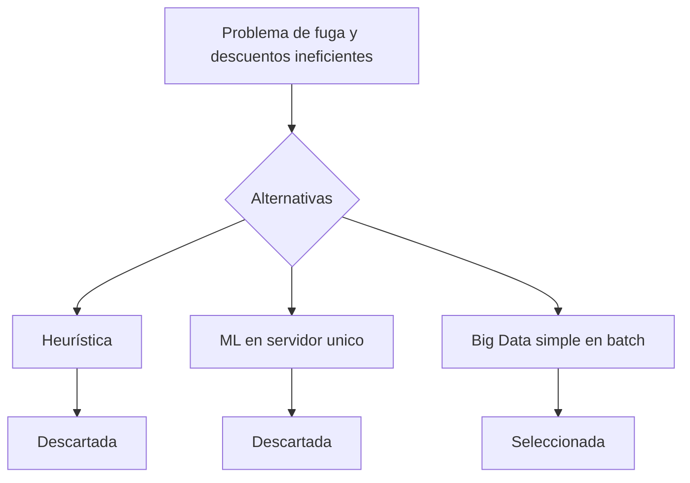
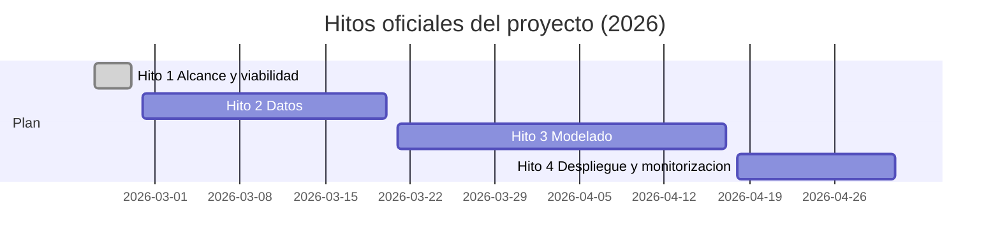

# Hito 1: Alcance y viabilidad (versión simple y alcanzable)

## Datos de la entrega

- Asignatura: **DESARROLLO Y DESPLIEGUE DE SOLUCIONES BIG DATA**
- Máster: **Máster Universitario en Big Data y Computación en la Nube**
- Curso académico: **2025-2026**
- Integrantes:
- **Alonso Marcos Muñoz** (`Alonso.Marcos@alu.uclm.es`)
- **JBJOSE Barros Ribademar** (`Jose.Barros1@alu.uclm.es`)
- Fecha de edición: **febrero de 2026**

## 1. Objetivo del hito

Definir el problema de negocio, justificar una solución técnica viable y simple, estimar el valor económico con hipótesis conservadoras, y dejar una planificación clara para los hitos siguientes.

Fecha oficial del hito: **27 de febrero de 2026**.

## 2. Alcance y viabilidad

### 2.1 Definición del problema de negocio (texto literal asignado)

A continuación se detallan los escenarios de negocio propuestos para el desarrollo del proyecto práctico de la asignatura. Cada opción describe un problema real de la industria, cuantificando el impacto económico actual y la oportunidad de mejora mediante técnicas de big data. Leed atentamente las métricas y el contexto de cada caso antes de marcar vuestra elección definitiva, ya que este será el dominio sobre el que trabajaréis durante todo el ciclo de vida del proyecto.

Fugas de clientes en telecomunicaciones
La operadora de telecomunicaciones gestiona una base de datos activa de 2.000.000 de clientes particulares en un mercado altamente saturado. Actualmente, la compañía se enfrenta a una tasa de rotación mensual del 3% (60.000 clientes abandonan la compañía cada mes), una hemorragia que las campañas de fidelización genéricas no logran detener.

Esta falta de inteligencia comercial genera un impacto negativo por dos vías. Por un lado, la incapacidad de anticiparse al descontento provoca la marcha de 40.000 usuarios recuperables cada mes (lo que implica que el sistema actual solo retiene o detecta a 1 de cada 3 fugas reales). Dado que el valor de vida promedio perdido por cliente se estima en 100 euros de margen neto anual, la compañía pierde una oportunidad de ingresos de 4.000.000 de euros mensuales.

Por otro lado, la estrategia de retención indiscriminada ("café para todos") ofrece descuentos agresivos a clientes que no tenían intención real de irse. Actualmente, se regalan incentivos innecesarios al 5% de la base leal (aproximadamente 100.000 clientes). Con un coste medio de 10 euros por descuento erróneo, se desperdician 1.000.000 de euros mensuales en recursos mal asignados. El balance total de pérdidas operativas asciende a 5.000.000 de euros al mes.

### 2.2 Planteamiento y selección de la solución técnica

Se evalúan las tres opciones requeridas por la guía:

1. Solución heurística con reglas manuales y campañas genéricas.
2. Modelo de ML tradicional en servidor único.
3. Solución Big Data distribuida en Databricks (opción elegida).

#### Decisión

- Se descarta la solución heurística porque no escala y mantiene ineficiencias.
- Se descarta el servidor único porque limita el crecimiento y la trazabilidad.
- Se elige una **arquitectura Big Data mínima viable**, pero sin complejidad innecesaria:
  - procesamiento por lotes (batch),
  - entrenamiento periódico,
  - primer modelo base simple,
  - despliegue inicial no crítico en tiempo real.

### 2.3 Evaluación de la viabilidad y valor

#### 2.3.1 Viabilidad técnica

Viable por:

- Volumen de clientes alto (2 millones) y datos históricos acumulables.
- Problema de clasificación estándar (predicción de fuga).
- Posibilidad de arrancar con un enfoque simple (batch semanal/mensual).
- Escalabilidad posterior sin rehacer la base técnica.

#### 2.3.2 Viabilidad económica (estimación conservadora)

Pérdidas actuales del problema:

- Fugas recuperables: 4.000.000 EUR/mes.
- Descuentos innecesarios: 1.000.000 EUR/mes.

Escenario de mejora conservador para una primera versión:

1. Reducción del 4% en fugas recuperables:

`4.000.000 x 0,04 = 160.000 EUR/mes`

2. Reducción del 5% en descuentos innecesarios:

`1.000.000 x 0,05 = 50.000 EUR/mes`

Beneficio estimado mensual:

`160.000 + 50.000 = 210.000 EUR/mes`

Coste mensual estimado (referencia simple de la guía):

- Equipo (2 personas): 10.000 EUR/mes.
- Infraestructura cloud: 1.100 EUR/mes.

Coste total:

`11.100 EUR/mes`

ROI mensual estimado:

`((210.000 - 11.100) / 11.100) x 100 = 1.791,89%`

Amortización aproximada:

`(11.100 / 210.000) x 30 = 1,59 días`

Conclusión: incluso con hipótesis modestas, el proyecto es rentable.

#### 2.3.3 Viabilidad ética y legal

Controles mínimos desde el inicio:

- Seudonimización de identificadores personales.
- Acceso a datos por roles y principio de mínimo privilegio.
- Registro de decisiones de modelo para trazabilidad.
- Medición básica de equidad con **Equal Opportunity Difference** (diferencia de TPR entre grupos protegidos).

### 2.4 Planificación y recursos

#### 2.4.1 KPIs de negocio y métricas técnicas

KPIs de negocio comprometidos para primera entrega funcional:

- Reducir en 4% la pérdida por fugas recuperables.
- Reducir en 5% el coste por descuentos innecesarios.

Métricas técnicas asociadas (objetivo inicial realista):

- Mejorar la tasa de retención/detección respecto al punto base actual (1 de cada 3 fugas).
- Mantener campañas más precisas para reducir descuentos no necesarios.
- Priorizar estabilidad y reproducibilidad antes que exprimir rendimiento máximo.

#### 2.4.2 Equipo (pareja)

- Perfil 1: Ingeniería de datos y pipeline.
- Perfil 2: Modelado y evaluación.
- Trabajo compartido: memoria, validación de métricas y defensa.

#### 2.4.3 Fuentes de datos (mínimo viable)

- Maestro de clientes.
- Historial de bajas/churn.
- Uso de servicios y facturación.
- Historial de campañas de retención.

#### 2.4.4 Stack tecnológico (simple)

- Databricks + Delta Lake.
- Spark para procesamiento batch.
- Spark MLlib para primer modelo.
- MLflow para trazabilidad básica.
- GitHub para control de versiones.

#### 2.4.5 Calendario oficial de hitos

## 3. Checklist de cumplimiento (guía 2.1-2.4)

- [x] Problema de negocio copiado de forma literal.
- [x] Evaluación de tres alternativas técnicas.
- [x] Viabilidad técnica, económica y ética.
- [x] KPIs, recursos, stack y cronograma oficial.
- [x] Diagramas Mermaid incluidos.
