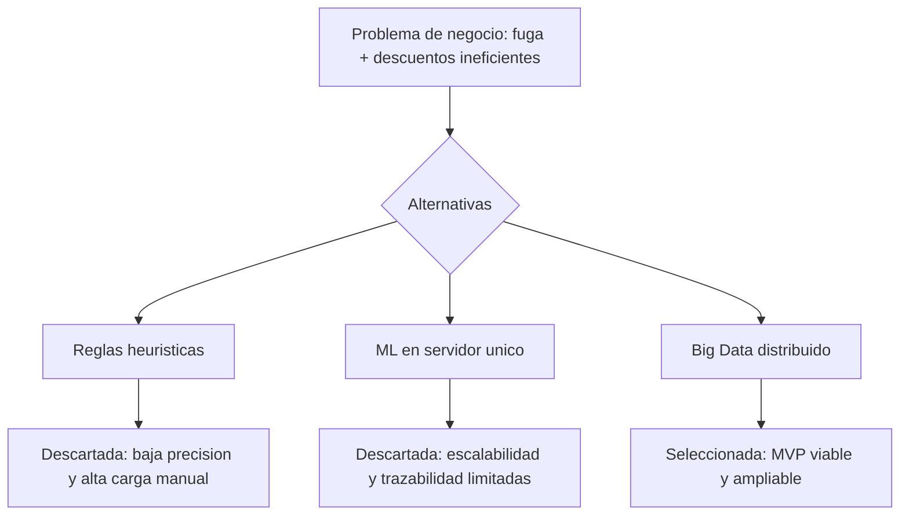
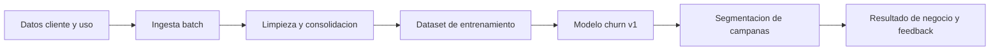
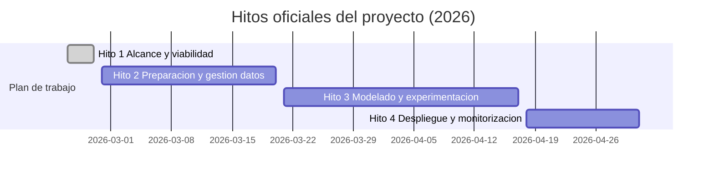

# Hito 1: Alcance y viabilidad

## Datos de la entrega

- Asignatura: **DESARROLLO Y DESPLIEGUE DE SOLUCIONES BIG DATA**
- Máster: **Máster Universitario en Big Data y Computación en la Nube**
- Curso académico: **2025-2026**
- Integrantes:
- **Alonso Marcos Muñoz** (`Alonso.Marcos@alu.uclm.es`)
- **JBJOSE Barros Ribademar** (`Jose.Barros1@alu.uclm.es`)
- Fecha de elaboración: **febrero de 2026**

## 1. Introducción del hito

Este primer hito cierra el alcance del proyecto antes de entrar en la fase técnica de implementación. El objetivo no es solo describir el problema de negocio, sino justificar por qué tiene sentido abordarlo con una solución de datos, qué valor económico realista puede aportar y cómo se va a ejecutar con recursos limitados, en el calendario oficial de la asignatura.

La propuesta se ha redactado con un enfoque deliberadamente alcanzable: empezar con una primera versión funcional (MVP) y evitar compromisos técnicos innecesarios para una entrega inicial. Esta decisión mantiene el equilibrio entre rigor académico, viabilidad de ejecución en pareja y potencial de mejora en los hitos siguientes.

Fecha oficial de cierre del hito: **27 de febrero de 2026**.

## 2. Alcance y viabilidad

### 2.1 Definición del problema de negocio (texto literal asignado)

A continuación se detallan los escenarios de negocio propuestos para el desarrollo del proyecto práctico de la asignatura. Cada opción describe un problema real de la industria, cuantificando el impacto económico actual y la oportunidad de mejora mediante técnicas de big data. Leed atentamente las métricas y el contexto de cada caso antes de marcar vuestra elección definitiva, ya que este será el dominio sobre el que trabajaréis durante todo el ciclo de vida del proyecto.

Fugas de clientes en telecomunicaciones
La operadora de telecomunicaciones gestiona una base de datos activa de 2.000.000 de clientes particulares en un mercado altamente saturado. Actualmente, la compañía se enfrenta a una tasa de rotación mensual del 3% (60.000 clientes abandonan la compañía cada mes), una hemorragia que las campañas de fidelización genéricas no logran detener.

Esta falta de inteligencia comercial genera un impacto negativo por dos vías. Por un lado, la incapacidad de anticiparse al descontento provoca la marcha de 40.000 usuarios recuperables cada mes (lo que implica que el sistema actual solo retiene o detecta a 1 de cada 3 fugas reales). Dado que el valor de vida promedio perdido por cliente se estima en 100 euros de margen neto anual, la compañía pierde una oportunidad de ingresos de 4.000.000 de euros mensuales.

Por otro lado, la estrategia de retención indiscriminada ("café para todos") ofrece descuentos agresivos a clientes que no tenían intención real de irse. Actualmente, se regalan incentivos innecesarios al 5% de la base leal (aproximadamente 100.000 clientes). Con un coste medio de 10 euros por descuento erróneo, se desperdician 1.000.000 de euros mensuales en recursos mal asignados. El balance total de pérdidas operativas asciende a 5.000.000 de euros al mes.

### 2.2 Planteamiento y selección de la solución técnica

Siguiendo la guía del proyecto, se analizaron tres escenarios: (1) heurístico por reglas, (2) machine learning en servidor monolítico y (3) arquitectura big data distribuida. La comparación no se centró en “usar la tecnología más avanzada”, sino en elegir la alternativa que mejor responde al problema de churn con coste y complejidad controlados.

| Criterio de decisión | Solución heurística | ML monolítico | Big Data distribuido (MVP) |
|---|---|---|---|
| Escalabilidad con 2M clientes y crecimiento histórico | Baja | Media | Alta |
| Esfuerzo de mantenimiento operativo | Alto | Medio | Medio |
| Capacidad para integrar nuevas fuentes y features | Baja | Media | Alta |
| Trazabilidad para auditoría y defensa | Baja | Media | Alta |
| Riesgo de obsolescencia a medio plazo | Alto | Medio | Bajo |

La opción heurística se descarta porque no corrige el problema estructural: campañas masivas con baja precisión. El modelo monolítico mejora la situación, pero limita la evolución del proyecto cuando aumenten volumen y complejidad de datos. Por ese motivo se selecciona una arquitectura big data, pero en una versión mínima viable: procesamiento por lotes, primer modelo de clasificación y ciclo de mejora incremental en los hitos 2 y 3.

### 2.3 Evaluación de la viabilidad y valor

#### 2.3.1 Viabilidad técnica

La viabilidad técnica es favorable por cuatro razones. Primero, el caso tiene suficiente masa crítica (2 millones de clientes activos) para justificar un enfoque de datos. Segundo, la variable objetivo (churn) es natural en un problema de clasificación supervisada. Tercero, el dominio permite construir señales predictivas razonables (antigüedad, uso de servicios, incidencias, facturación e interacción con campañas). Cuarto, el diseño por lotes reduce riesgo de implementación al inicio y permite entregar resultados medibles sin exigir tiempo real.

Tal como indica la guía, el detalle exacto de volumen de tablas, años de histórico y cardinalidades quedará fijado definitivamente al recibir y perfilar el dataset de trabajo en el hito 2. En este hito se valida la factibilidad conceptual y operativa.

#### 2.3.2 Viabilidad económica (escenario conservador)

Se parte de las pérdidas mensuales declaradas en el enunciado:

- Fugas recuperables no evitadas: **4.000.000 EUR/mes**.
- Incentivos mal asignados: **1.000.000 EUR/mes**.

Para no sobreprometer resultados, el escenario económico del MVP usa mejoras moderadas:

- Reducción del 4% en fuga recuperable: `4.000.000 x 0,04 = 160.000 EUR/mes`.
- Reducción del 5% en descuentos innecesarios: `1.000.000 x 0,05 = 50.000 EUR/mes`.

Beneficio total estimado: `210.000 EUR/mes`.

Coste mensual estimado (alineado con una puesta en marcha académica y de bajo riesgo):

- Equipo técnico (2 personas): `10.000 EUR/mes`.
- Infraestructura cloud: `1.100 EUR/mes`.

Coste total estimado: `11.100 EUR/mes`.

Con estas hipótesis:

- ROI mensual: `((210.000 - 11.100) / 11.100) x 100 = 1.791,89%`.
- Payback aproximado: `(11.100 / 210.000) x 30 = 1,59 días`.

La lectura de negocio es clara: incluso en un escenario prudente, el proyecto tiene margen económico suficiente para justificar su ejecución y mejora progresiva.

#### 2.3.3 Viabilidad ética y legal

La viabilidad no depende solo del ROI. El diseño debe ser técnicamente útil, económicamente rentable y éticamente defendible. Para ello se establecen tres medidas desde el inicio:

1. Protección de datos personales mediante seudonimización y control de accesos por rol.
2. Trazabilidad de decisiones (versionado de datasets, modelos y ejecuciones de scoring).
3. Seguimiento de sesgo con una métrica explícita de fairness: **Equal Opportunity Difference** (comparación de TPR entre grupos).

El objetivo en esta fase no es “resolver fairness al 100%”, sino prevenir riesgos desde el diseño para no trasladar deuda ética al final del proyecto.

### 2.4 Planificación y recursos

#### 2.4.1 KPIs de negocio y traducción técnica

Los objetivos del MVP se han ajustado para que sean exigentes pero alcanzables:

- Reducir en 4% la pérdida por fuga recuperable.
- Reducir en 5% el coste por incentivos innecesarios.

Traducción a magnitudes operativas:

- Fuga recuperable no evitada: pasar de 40.000 a 38.400 clientes/mes.
- Incentivos mal asignados: pasar de 100.000 a 95.000 clientes/mes.

Traducción a metas técnicas iniciales:

- Mejorar la detección efectiva sobre clientes con riesgo real de baja.
- Incrementar la precisión de campañas para evitar descuentos a clientes que no iban a abandonar.
- Priorizar estabilidad del pipeline y reproducibilidad de resultados frente a optimización agresiva en la primera iteración.

#### 2.4.2 Equipo de trabajo

El proyecto se desarrolla en pareja con reparto funcional sencillo:

- Perfil de ingeniería de datos/MLOps: ingesta, calidad de datos, orquestación y ejecución en plataforma.
- Perfil de modelado: construcción de variables, entrenamiento, evaluación y análisis de error.

Ambos integrantes participan en definición de decisiones, memoria y defensa, para mantener autoría compartida y coherencia técnica.

#### 2.4.3 Fuentes y stack tecnológico

Fuentes mínimas previstas para primera versión:

- Maestro de clientes.
- Histórico de bajas/churn.
- Uso de servicios y facturación.
- Histórico de campañas y respuesta.

Stack adoptado para el MVP:

- Databricks + Delta Lake (almacenamiento y procesamiento).
- Spark en modo batch para transformación y entrenamiento.
- Spark MLlib para modelo base.
- MLflow para trazabilidad de experimentos.
- GitHub para control de versiones.

#### 2.4.4 Cronograma oficial del proyecto

## 3. Cierre del hito

El alcance queda cerrado con una propuesta coherente en las cuatro dimensiones exigidas por la guía: definición del problema, selección técnica razonada, viabilidad completa y planificación. La estrategia adoptada evita promesas difíciles de sostener en febrero de 2026 y prioriza una entrega sólida, medible y defendible. Sobre esta base, el siguiente paso natural es ejecutar el hito 2 para validar calidad del dato y materializar la arquitectura de trabajo en Databricks.
