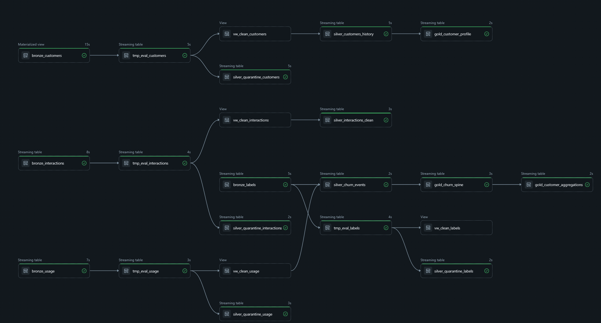

# Memoria técnica incremental del proyecto (Hitos 1 y 2)

## Datos de la entrega

- Asignatura: **Desarrollo y Despliegue de Soluciones Big Data**
- Máster: **Máster Universitario en Big Data y Computación en la Nube**
- Curso académico: **2025-2026**
- Integrantes:
  - Alonso Marcos Muñoz (`Alonso.Marcos@alu.uclm.es`)
  - Jose Barros Ribademar (`Jose.Barros1@alu.uclm.es`)

---

## Hito 1: Alcance y viabilidad

### Introducción del hito

El objetivo de este primer hito es cerrar el alcance del proyecto con una justificación técnica y económica suficiente para sustentar su ejecución durante el resto de la asignatura. En esta fase no se plantea un prototipo parcial, sino una propuesta completa de trabajo que permita defender qué problema de negocio se pretende resolver, por qué una arquitectura de datos distribuida es adecuada y qué condiciones de viabilidad deben cumplirse para que el proyecto sea defendible en términos académicos y profesionales.

La memoria se ha redactado como documento de base para los siguientes hitos, de forma que cada decisión tomada en febrero de 2026 quede trazada con su hipótesis asociada y pueda validarse posteriormente con resultados de implementación. La fecha oficial de cierre del hito es el **27 de febrero de 2026**.

### Alcance y viabilidad

#### Definición del problema de negocio

La empresa de telecomunicaciones analizada gestiona una cartera activa de 2.000.000 de clientes particulares en un mercado muy competitivo. En el escenario de partida se observa una rotación mensual del 3%, equivalente a 60.000 bajas cada mes. Esta dinámica refleja que las campañas generalistas de retención no están siendo suficientes para priorizar a los clientes con mayor probabilidad de abandono y mayor impacto económico.

Desde el punto de vista financiero, el problema se concentra en dos frentes. Por un lado, se estima que 40.000 bajas mensuales son potencialmente recuperables y que cada cliente perdido supone, de media, 100 euros de margen neto anual no capturado. Por otro lado, la compañía aplica descuentos de forma poco precisa sobre una parte de clientes que no presenta riesgo real de fuga, lo que incrementa el coste comercial sin retorno proporcional.

$$
\text{Pérdida por fugas recuperables} = 40.000 \times 100 = 4.000.000\ \text{EUR/mes}
$$

$$
\text{Coste por incentivos mal asignados} = 100.000 \times 10 = 1.000.000\ \text{EUR/mes}
$$

$$
\text{Impacto económico mensual estimado} = 5.000.000\ \text{EUR/mes}
$$

Este volumen de pérdida justifica abordar el problema con una solución analítica que permita identificar mejor el riesgo de churn y mejorar la asignación de incentivos.

#### Análisis y selección de la solución técnica

Para resolver el caso se valoraron tres enfoques: reglas heurísticas, aprendizaje automático en entorno monolítico y arquitectura big data distribuida. El enfoque heurístico ofrece rapidez inicial, pero su mantenimiento crece de forma no lineal al aumentar la casuística y sufre cuando cambian los patrones de comportamiento. El enfoque monolítico con machine learning mejora la capacidad predictiva, aunque introduce limitaciones de escalabilidad, de trazabilidad operativa y de incorporación de nuevas fuentes en escenarios de mayor volumen.

La alternativa distribuida, basada en un pipeline de datos en Databricks con arquitectura medallion, se selecciona porque se ajusta mejor al tamaño de la base de clientes, permite evolucionar el sistema por capas (bronze, silver y gold) y facilita la gobernanza técnica del proyecto. Esta decisión no se fundamenta en complejidad tecnológica por sí misma, sino en su adecuación al problema y en su coherencia con los objetivos formativos de la asignatura.

#### Evaluación de la viabilidad

##### Viabilidad técnica

La viabilidad técnica se considera favorable por cuatro motivos. En primer lugar, existe masa crítica de datos para entrenar y evaluar modelos de clasificación supervisada. En segundo lugar, el problema tiene una definición clara de variable objetivo (baja/no baja) y un marco temporal razonable para construir etiquetas y ventanas de observación. En tercer lugar, se dispone de señales potencialmente explicativas, como antigüedad del cliente, uso de servicios, incidencias, facturación e historial de interacción comercial. En cuarto lugar, la ejecución en modo batch reduce el riesgo de implementación temprana y permite priorizar robustez, reproducibilidad y calidad del dato antes de plantear escenarios de inferencia más exigentes.

##### Viabilidad económica

El escenario económico se ha planteado con hipótesis conservadoras para evitar sobreestimar el impacto. Si el sistema consigue reducir un 5% las fugas recuperables y, en paralelo, disminuir un 5% el coste de incentivos mal dirigidos, el beneficio mensual esperado sería de 250.000 euros.

$$
\text{Beneficio por mejora en fugas} = 4.000.000 \times 0{,}05 = 200.000\ \text{EUR/mes}
$$

$$
\text{Beneficio por mejora en incentivos} = 1.000.000 \times 0{,}05 = 50.000\ \text{EUR/mes}
$$

$$
\text{Beneficio total estimado} = 250.000\ \text{EUR/mes}
$$

En cuanto a costes, se considera una carga mensual de 10.000 euros de dedicación técnica y 1.100 euros de infraestructura cloud, lo que sitúa el coste total en 11.100 euros al mes.

$$
\text{ROI mensual} = \left(\frac{250.000 - 11.100}{11.100}\right)\times 100 = 2.152\%
$$

$$
\text{Payback aproximado} = \frac{11.100}{250.000}\times 30 = 1{,}3\ \text{días}
$$

Aunque estos resultados dependen de hipótesis que deberán contrastarse en los hitos de datos y modelado, el orden de magnitud obtenido muestra que el caso tiene sentido económico incluso en un escenario prudente.

##### Viabilidad ética y legal

La propuesta incorpora desde el inicio restricciones de cumplimiento alineadas con RGPD y con buenas prácticas de IA aplicada. Se prevé seudonimización de identificadores, control de accesos sobre datasets sensibles y trazabilidad de transformaciones y versiones de modelo. Además, se incluye evaluación de sesgo mediante métricas de equidad, con el objetivo de detectar desviaciones de rendimiento entre grupos y evitar decisiones comerciales sistemáticamente desfavorables para colectivos concretos.

### Planificación y recursos

#### Objetivos de negocio y traducción técnica

Los objetivos operativos para el proyecto son reducir en un 5% la pérdida asociada a fugas recuperables y reducir en un 5% el coste de incentivos innecesarios. Traducido a magnitudes de seguimiento mensual, esto implica pasar de 40.000 a 38.000 bajas recuperables y de 100.000 a 95.000 incentivos potencialmente mal asignados. En términos técnicos, estos objetivos se transforman en tres líneas de trabajo: mejorar la capacidad de detección temprana del riesgo de churn, aumentar la precisión de segmentación para campañas de retención y mantener estabilidad de pipeline para garantizar repetibilidad de resultados.

#### Organización del equipo

El trabajo se organiza en una estructura colaborativa de dos perfiles complementarios. Una parte se centra en ingeniería de datos y MLOps, abarcando ingesta, control de calidad, orquestación y trazabilidad del pipeline. La otra parte se orienta al modelado, incluyendo construcción de variables, entrenamiento, evaluación y análisis de error. Esta distribución no es rígida; se revisa de forma continua para equilibrar carga y acelerar resolución de incidencias.

#### Fuentes de datos y stack tecnológico

La solución se apoyará en cuatro fuentes funcionales: maestro de clientes, histórico de bajas, registros de uso y facturación, e histórico de campañas con respuesta observada. Sobre estas fuentes se implementará un pipeline en Databricks y Delta Lake, con procesamiento distribuido en Spark, modelado con Spark MLlib y seguimiento experimental mediante MLflow. El control de versiones y la coordinación del desarrollo se mantienen en GitHub para preservar trazabilidad técnica y facilitar auditoría del trabajo.

#### Cronograma oficial del proyecto

El calendario de la asignatura queda estructurado en cuatro hitos consecutivos: Hito 1 (Alcance y viabilidad) del 24/02/2026 al 27/02/2026; Hito 2 (Preparación y gestión de datos) del 28/02/2026 al 20/03/2026; Hito 3 (Modelado y experimentación) del 21/03/2026 al 17/04/2026; y Hito 4 (Despliegue y monitorización) del 18/04/2026 al 01/05/2026. La planificación del presente documento está alineada con ese marco oficial.

### Cierre del Hito 1

Con este hito queda definido un alcance técnicamente consistente y económicamente justificado para el proyecto de churn telco. La propuesta establece el problema de negocio, argumenta la elección arquitectónica, delimita condiciones de viabilidad y fija objetivos medibles para los siguientes entregables. El siguiente paso es ejecutar el Hito 2 con foco en preparación del dato, validación de calidad y materialización del pipeline medallion en el entorno de trabajo.

---

## Hito 2: Preparación y gestión de datos

### Objetivo del hito

El objetivo real de este segundo hito ha sido pasar del diseño conceptual del Hito 1 a una implementación de datos que funcione de verdad en Databricks, con ejecución completa y repetible. En otras palabras, no se trataba solo de “tener scripts”, sino de validar que el proyecto podía desplegarse, correr sin intervención manual y dejar un resultado coherente para el inicio de Hito 3.

Para conseguirlo, el trabajo se organizó como un proceso incremental: primero estabilizamos el entorno de ejecución y el bundle, después cerramos la arquitectura medallion por capas, y finalmente incorporamos orquestación tipo producción (pipeline + notebook final), siguiendo el patrón del proyecto de referencia del profesor pero adaptado a nuestra temática de churn telco.

### Implementación en Databricks

La implementación se articula en torno a Databricks Asset Bundles:

- `codigo/databricks.yml` como punto de entrada de configuración.
- `codigo/resources/telco_churn.pipeline.yml` para la definición del pipeline medallion.
- `codigo/resources/telco_churn.job.yml` para la orquestación final en dos tareas.

Una decisión importante de esta fase fue consolidar un único workspace operativo para evitar límites de cuota y problemas de permisos del entorno inicial. Sobre ese workspace se normalizó la capa de gobierno en Unity Catalog con una estructura explícita y descriptiva:

- Catálogo: `workspace`
- Esquema operativo del proyecto: `workspace.telco_churn`
- Volumen de entrada: `/Volumes/workspace/telco_churn/landing_zone`

Además de la estructura, se añadieron descripciones visibles en catálogo, esquema, volumen y pipeline para que cualquier miembro del equipo pueda entender rápidamente qué recurso es oficial y cuál no, directamente desde la UI de Databricks, sin tener que abrir código local.

Durante la fase de despliegue apareció una incidencia crítica de operativa (`413 Request Entity Too Large`) al intentar sincronizar datos masivos junto con el bundle. La solución fue separar de forma estricta “código versionable” y “artefacto generado”, excluyendo del `sync` los directorios de datos (`context/**`, `events/**`, `source_buffer/**`) y logs de generación. Este ajuste fue clave para estabilizar `validate/deploy` y dejar un flujo reproducible para ambos integrantes del equipo.

### Fuentes de datos y ventana temporal

La generación de datos sintéticos se realiza con `codigo/src/medallion_pipeline/utilities/generate.py`. Este script crea el maestro de clientes (`context/customers.csv`), los eventos mensuales de uso, interacciones y etiquetas en `events/YYYY/MM/data.json`, y una zona adicional `source_buffer` para datos de 2025 con deriva simulada de producción.

En la práctica, el script genera un volumen de información suficientemente grande para tensionar la ejecución en Free Edition y obligar a tomar decisiones técnicas reales de rendimiento. Esto era un objetivo del hito: demostrar un escenario cercano a Big Data, no un ejemplo mínimo.

Desde el punto de vista temporal, en Hito 2 se decidió mantener una frontera clara entre histórico y producción simulada:

- `events/*` se trata como histórico de entrenamiento (2023-2024).
- `source_buffer/*` se conserva como bloque de 2025 con deriva, útil para validación temporal posterior.

Esta separación evita mezclar periodos sin control y deja preparado el terreno para un Hito 3 metodológicamente correcto, especialmente en lo relativo a fuga temporal de información.

### Arquitectura medallion ejecutada

#### Capa bronze

La capa bronze se implementa en `codigo/src/medallion_pipeline/transformations/01_bronze_ingestion.py`. Aquí priorizamos robustez de ingesta y trazabilidad sobre transformación avanzada. El diseño combina carga batch para contexto de cliente y Auto Loader en streaming para eventos de uso, etiquetas e interacciones.

Como salida se materializan:

- `bronze_customers` (batch)
- `bronze_usage` (streaming)
- `bronze_labels` (streaming)
- `bronze_interactions` (streaming)

En esta capa se añadieron metadatos de auditoría (`ingestion_timestamp`, `source_file`) y tolerancia de esquema para evitar bloqueos ante cambios de estructura en JSON. Esto nos permitió mantener estabilidad de actualización incluso cuando el volumen de datos y el número de ficheros creció de forma notable.

#### Capa silver

La capa silver (`codigo/src/medallion_pipeline/transformations/02_silver_transformation.py`) fue el núcleo técnico del hito. Aquí se aplican reglas de calidad, se separa explícitamente el dato inválido y se construyen entidades listas para explotación analítica.

Se materializan:

- `silver_customers_history` (SCD2 con AUTO CDC)
- `silver_churn_events`
- `silver_interactions_clean`
- Tablas de cuarentena:
  - `silver_quarantine_customers`
  - `silver_quarantine_usage`
  - `silver_quarantine_labels`
  - `silver_quarantine_interactions`

El historial de cliente se implementa con enfoque SCD2 mediante AUTO CDC, porque de cara a modelado y serving es más importante conservar la evolución temporal de atributos que sobrescribir el último estado sin contexto.

Durante el desarrollo de silver apareció un problema de consumo de memoria asociado a joins streaming exigentes. Para estabilizar la ejecución en nuestro entorno se rediseñó el flujo hacia un patrón stream-static en la unificación de eventos relevantes. Esta modificación mantuvo la lógica funcional del pipeline y, al mismo tiempo, redujo presión de estado y tiempos muertos.

#### Capa gold

La capa gold se estructuró en tres scripts independientes para mantener modularidad y trazabilidad, siguiendo la filosofía del ejemplo del profesor:

- `03_gold_churn_spine.py` -> `gold_churn_spine`
- `03_gold_customer_profile.py` -> `gold_customer_profile`
- `03_gold_customer_aggregations.py` -> `gold_customer_aggregations`

Este split evita archivos monolíticos difíciles de mantener y permite evolucionar cada tabla de forma controlada en siguientes hitos.

Además, se dejó preparada la semántica de claves para una futura integración real con Online Feature Store: `gold_customer_profile` mantiene clave primaria temporal y `gold_customer_aggregations` también quedó declarada con `PRIMARY KEY (... TIMESERIES)`, de forma que cuando se disponga de licencia completa no haya que rehacer la base de modelado.

# Control de Calidad — Capa Silver

## Centralización de reglas

Las reglas de calidad se centralizan en `codigo/src/medallion_pipeline/rules/customers.py` para evitar lógica duplicada y facilitar la revisión funcional. Esta centralización simplifica el mantenimiento: cuando una regla cambia, la actualización se realiza en un único punto y se propaga automáticamente al flujo completo. Cada regla es una expresión SQL que debe evaluar a `TRUE` para que un registro se considere válido; los registros que no la superan son marcados con el flag `is_quarantined` en lugar de descartados, preservando trazabilidad.

---

## Reglas por entidad

### Clientes (`get_customer_rules`)

La entidad de clientes es el eje central del modelo de churn. Sus reglas buscan garantizar que cada registro represente a un cliente real e identificable, con datos de contrato y facturación coherentes.

| Regla | Expresión SQL | Justificación |
|-------|---------------|---------------|
| `valid_customer_id` | `customer_id IS NOT NULL` | Sin identificador no es posible vincular el registro con ninguna otra entidad del modelo. Es la clave de integridad referencial del sistema. |
| `valid_age` | `age > 0 AND age < 120` | Filtra edades biológicamente imposibles originadas por errores de ingesta o valores por defecto. El rango 1–119 cubre la totalidad de clientes reales posibles. |
| `valid_contract_type` | `contract_type IN ('monthly', 'annual')` | El tipo de contrato determina la lógica de cálculo de churn. Valores fuera del dominio conocido indicarían un error de codificación upstream que podría distorsionar los modelos. |
| `valid_monthly_fee` | `monthly_fee >= 0` | Una tarifa negativa es económicamente incoherente y señala un error de transformación. Se permite el valor cero para cubrir planes gratuitos o promocionales. |

---

### Uso (`get_usage_rules`)

Los registros de uso son la principal fuente de señal de comportamiento del cliente. La calidad en esta entidad es crítica porque sus valores alimentan directamente las features del modelo predictivo.

| Regla | Expresión SQL | Justificación |
|-------|---------------|---------------|
| `valid_customer_id` | `customer_id IS NOT NULL` | Necesario para asociar el consumo a un cliente concreto. Sin él el registro es inutilizable para el análisis. |
| `valid_year_month` | `year_month IS NOT NULL` | El período de referencia es imprescindible para la agregación mensual y la construcción de la ventana temporal del modelo. |
| `valid_data_consumed` | `data_consumed_gb >= 0` | El consumo de datos no puede ser negativo. Valores negativos apuntan a errores de medición o reversiones mal registradas. |
| `valid_call_minutes` | `call_minutes >= 0` | Análogamente, los minutos de llamada son una magnitud no negativa. Un valor negativo indicaría un error en el sistema de medición. |
| `valid_bill_amount` | `bill_amount >= 0` | El importe facturado debe ser cero o positivo. Importes negativos pueden deberse a abonos incorrectamente clasificados que contaminarían los ratios de facturación. |

---

### Etiquetas (`get_label_rules`)

Las etiquetas representan la variable objetivo del modelo de churn. Su integridad es especialmente sensible: un error aquí no degrada la calidad del dato sino directamente la del entrenamiento.

| Regla | Expresión SQL | Justificación |
|-------|---------------|---------------|
| `valid_customer_id` | `customer_id IS NOT NULL` | Una etiqueta sin cliente asociado no puede incorporarse al dataset de entrenamiento ni de evaluación. |
| `valid_year_month` | `year_month IS NOT NULL` | La etiqueta de churn es inherentemente temporal. Sin período de referencia no es posible alinearla con las features del mes correspondiente. |

---

### Interacciones (`get_interaction_rules`)

Los eventos de interacción enriquecen el perfil del cliente con señales de comportamiento cualitativo. La validación se centra en la coherencia del tipo de interacción, ya que determina cómo se agregan y ponderan los eventos en la capa gold.

| Regla | Expresión SQL | Justificación |
|-------|---------------|---------------|
| `valid_customer_id` | `customer_id IS NOT NULL` | Sin cliente identificado la interacción no puede vincularse al historial correspondiente. |
| `valid_timestamp` | `timestamp IS NOT NULL` | La ordenación temporal de las interacciones es necesaria para construir features de recencia y frecuencia. Sin timestamp el evento pierde su dimensión temporal. |
| `valid_interaction_type` | `interaction_type IN (...)` | El tipo de interacción está codificado en un dominio cerrado de 13 valores. Cualquier valor fuera de este dominio indica un error de integración upstream y podría introducir categorías espurias en el modelo. |

---

## Robustez y resolución de incidencias

En términos de robustez, el hito incluyó resolución de incidencias reales de plataforma y de código:

- `ImportError: attempted relative import with no known parent package` — originado por la ejecución de módulos fuera del contexto de paquete esperado por Python; resuelto mediante ajuste del `sys.path` en el entorno DLT.
- `UNRESOLVED_COLUMN` en AUTO CDC por referencia a `_rescued_data` no presente en la entidad de clientes; resuelto condicionando la selección de columnas a las presentes en el esquema fuente.
- `CANNOT_CHANGE_DATASET_TYPE` al refactorizar una tabla gold de tipo incorrecto; resuelto eliminando la tabla obsoleta antes del redespliegue.
- Eventos `OUT_OF_MEMORY` en ejecuciones largas; mitigados ajustando el particionado y evitando materializaciones innecesarias en la capa de transformación.

El enfoque aplicado fue pragmático: primero aislar la causa raíz, después aplicar el ajuste mínimo seguro y, finalmente, validar con ejecución completa. Este ciclo se repitió hasta alcanzar actualizaciones estables en estado `COMPLETED`.
### Orquestación final del hito

Con la capa de datos estabilizada, cerramos el hito incorporando un job final de orquestación, equivalente en estructura al del proyecto de referencia:

- Job: `Telco Churn - Hito 2 Orchestration`
- Secuencia:
  1. Ejecución de pipeline Medallion
  2. Ejecución del notebook `codigo/notebooks/04_Feature_Store_Registration.py`

El notebook final se incorporó en `codigo/notebooks` y se adaptó para ejecución en modo simulación de Feature Store, ya que Free Edition no permite desplegar Lakebase/Online Feature Store. Aun así, el notebook valida la existencia de tablas gold, registra trazas de ejecución y conserva comentado el bloque de código real para activar en cuanto haya licencia.

También se configuraron notificaciones de éxito y error en el propio job para ambos integrantes del equipo, de forma que la ejecución quede monitorizada sin necesidad de revisar manualmente la UI en cada corrida.

### Decisiones de limpieza y gobierno del entorno

Como parte del cierre del hito se realizó limpieza de recursos antiguos para evitar duplicidades y confusión operativa. Se eliminaron volumen y objetos del esquema previo ya en desuso, manteniendo únicamente los recursos oficiales del proyecto en `workspace.telco_churn`.

Esta parte, aunque no cambia el resultado analítico, sí mejora la mantenibilidad del entorno: reduce riesgo de ejecutar sobre tablas antiguas y simplifica la explicación del proyecto durante defensa.

### Estado de cierre del Hito 2

El cierre técnico queda validado con:

- Pipeline en estado `COMPLETED` (update final validada: `aae8711c-6d5f-4502-b237-41f6b738c0e6`)
- Job de orquestación ejecutado en `SUCCESS` (`run_id`: `640253146512278`)
- Tablas medallion materializadas en `workspace.telco_churn`
- Recursos antiguos del esquema previo limpiados para evitar ambigüedad operativa

El DAG resultante refleja la linaje completa del pipeline, desde la ingesta en bronze hasta las tablas gold, con todas las tablas en estado `COMPLETED` y los flujos de cuarentena activos por entidad:
 

 
En términos académicos y técnicos, el objetivo del hito se considera cumplido: no solo existe código, sino una solución desplegada, ejecutada y trazable, con documentación reproducible tanto por CLI como por UI. Por tanto, Hito 2 queda cerrado con una base de datos estable y gobernada para iniciar Hito 3 sin rehacer ingeniería de datos.

## Hito 3: Modelado y experimentación (apartado reservado)

Sección reservada para completar en la siguiente entrega.

## Hito 4: Despliegue y monitorización (apartado reservado)

Sección reservada para completar en la última entrega.
