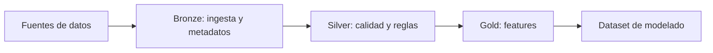

# Hito 2: Preparación y gestión de datos

## Datos de la entrega

- Asignatura: **DESARROLLO Y DESPLIEGUE DE SOLUCIONES BIG DATA**
- Máster: **Máster Universitario en Big Data y Computación en la Nube**
- Curso académico: **2025-2026**
- Integrantes:
- **Alonso Marcos Muñoz** (`Alonso.Marcos@alu.uclm.es`)
- **Jose Barros Ribademar** (`Jose.Barros1@alu.uclm.es`)
- Fecha prevista del hito: **20 de marzo de 2026**

## 1. Objetivo del hito

El objetivo de este hito es transformar el planteamiento de negocio del Hito 1 en una base de datos fiable para modelado. En términos prácticos, debemos dejar resuelto cómo se cargan los datos, cómo se validan, cómo se versionan y qué tablas finales se utilizarán en entrenamiento.

## 2. Alcance técnico

En esta fase vamos a centrarnos en cuatro bloques:

1. Configuración de entorno y trabajo colaborativo en Databricks.
2. Ingesta de datos en una capa inicial (bronze) con trazabilidad.
3. Refinamiento y control de calidad en capa intermedia (silver).
4. Construcción de tablas de características para el modelo (gold).

El alcance se limita a un flujo batch estable. No vamos a forzar ejecución continua en este hito porque no aporta valor inmediato para validar la calidad del dato.

## 3. Diseño de datos previsto

### 3.1 Capa bronze

En bronze queremos conservar el dato lo más cercano posible al origen, incluyendo metadatos de auditoría (momento de ingestión, fichero fuente y registros rescatados por errores de esquema).

### 3.2 Capa silver

En silver aplicaremos reglas explícitas de calidad: nulos en claves, rangos válidos, tipos de dato consistentes y coherencia temporal. Los registros que no cumplan reglas no se eliminarán sin control; se enviarán a cuarentena para poder analizarlos.

### 3.3 Capa gold

En gold construiremos dos grupos de variables:

- Variables de comportamiento reciente (ventanas temporales).
- Variables de perfil más estables.

El resultado será una tabla base lista para entrenamiento del modelo de churn en el Hito 3.

## 4. Plan de ejecución

Nuestro plan en pareja es secuencial, para evitar bloqueos:

- Semana 1: entorno, permisos, estructura de repositorio y primera carga.
- Semana 2: reglas de calidad y cuarentena.
- Semana 3: creación de tablas gold y validación final de datos.

Reparto de trabajo:

- Alonso: pipeline de ingesta, modelado de capas y trazabilidad técnica.
- Jose: definición de reglas de calidad, análisis de anomalías y validación de variables.
- Ambos: decisiones de diseño, documentación y preparación de defensa.

## 5. Riesgos y mitigación

- Riesgo de esquemas inestables: fijar validaciones tempranas y versionar cambios.
- Riesgo de datos incompletos para modelado: análisis de cobertura por variable antes de cerrar gold.
- Riesgo de retraso en integración: priorizar MVP de pipeline completo y ampliar después.

## 6. Resultado esperado del hito

Al cierre del Hito 2 debemos tener un pipeline ejecutable, tablas documentadas y un dataset consistente para entrenar el primer modelo en el Hito 3. Esto permitirá pasar del diseño conceptual a trabajo cuantitativo real sobre datos.
