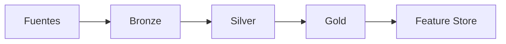

# Hito 2: Preparación y gestión de datos

## Datos de la entrega

- Asignatura: **DESARROLLO Y DESPLIEGUE DE SOLUCIONES BIG DATA**
- Máster: **Máster Universitario en Big Data y Computación en la Nube**
- Curso académico: **2025-2026**
- Integrantes:
- **Alonso Marcos Muñoz** (`Alonso.Marcos@alu.uclm.es`)
- **JBJOSE Barros Ribademar** (`Jose.Barros1@alu.uclm.es`)
- Fecha de edición de plantilla: **febrero de 2026**

## 1. Objetivo

Construir y validar la arquitectura de datos para soportar el modelado del churn, siguiendo la guía del proyecto.

Fecha objetivo oficial: **20 de marzo de 2026**.

## 2. Estructura recomendada de la memoria

### 2.1 Configuración del entorno y control de versiones

- Workspace compartido en Databricks.
- Permisos entre miembros de la pareja y profesorado.
- Repositorio GitHub y convención de ramas.

### 2.2 Infraestructura de datos y gobernanza

- Catálogo, esquema y objetos de datos (Unity Catalog).
- Convención de nombres por capas (`bronze`, `silver`, `gold`).

### 2.3 Capa bronze (ingesta)

- Carga de tablas de contexto y flujos de eventos.
- Metadatos de auditoría (`ingestion_timestamp`, `source_file`, `_rescued_data`).
- Verificación de recuentos y esquema.

### 2.4 Capa silver (calidad y refinamiento)

- Reglas de calidad (`expectations`) y modularización.
- Cuarentena (DLQ) y análisis de registros inválidos.
- Gestión de históricos (SCD tipo 2 / CDC).
- Cruces stream-stream con watermark.

### 2.5 Capa gold (features)

- Agregaciones dinámicas por ventana temporal.
- Perfiles estáticos.
- Tabla spine/ancla para entrenamiento.
- Preparación para feature store.

### 2.6 Ejecución y modos de pipeline

- Modo `Triggered` en entorno académico.
- Justificación de paso potencial a `Continuous`.

### 2.7 Evidencias obligatorias

- Esquemas y recuentos por tabla.
- Reglas de calidad aplicadas y resultado.
- Tabla(s) de cuarentena y análisis de causas.
- Diagrama Mermaid del flujo de datos final.

## 3. Diagramas Mermaid pendientes

## 4. Checklist de cierre

- [ ] Entorno colaborativo y versionado configurados.
- [ ] Capa bronze validada con metadatos.
- [ ] Capa silver con reglas y cuarentena.
- [ ] Capa gold lista para modelado.
- [ ] Memoria técnica y anexos completados.
