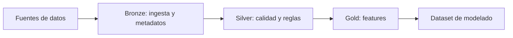

# Hito 2: Preparación y gestión de datos

## Datos de la entrega

- Asignatura: **DESARROLLO Y DESPLIEGUE DE SOLUCIONES BIG DATA**
- Máster: **Máster Universitario en Big Data y Computación en la Nube**
- Curso académico: **2025-2026**
- Integrantes:
  - **Alonso Marcos Muñoz** (`Alonso.Marcos@alu.uclm.es`)
  - **Jose Barros Ribademar** (`Jose.Barros1@alu.uclm.es`)
- Fecha prevista del hito: **20 de marzo de 2026**

## 1. Objetivo del hito

El objetivo de este hito es transformar el planteamiento de negocio del Hito 1 en una base de datos fiable para modelado. En términos prácticos, debemos dejar resuelto cómo se cargan los datos, cómo se validan, cómo se versionan y qué tablas finales se utilizarán en entrenamiento.

## 1.1 Coherencia con Hito 1

Este hito mantiene sin cambios los compromisos de alcance definidos en Hito 1:

- **Caso de uso**: predicción de churn en operadora telco.
- **Escala objetivo**: base de clientes masiva (millones de registros) y procesamiento batch.
- **KPIs de negocio**: soporte técnico a la reducción de fuga recuperable y de incentivos mal asignados.
- **Stack acordado**: Databricks + Delta Lake + Spark + Git (MLflow queda para Hito 3).
- **Criterio ético-técnico**: mantener trazabilidad del dato y preparar medición de fairness en fases de modelado.

En consecuencia, Hito 2 no redefine el problema: aterriza técnicamente la base de datos para cumplir esos objetivos.

## 2. Alcance técnico

En esta fase vamos a centrarnos en cuatro bloques:

1. Configuración de entorno y trabajo colaborativo en Databricks.
2. Ingesta de datos en una capa inicial (bronze) con trazabilidad.
3. Refinamiento y control de calidad en capa intermedia (silver).
4. Construcción de tablas de características para el modelo (gold).

El alcance se limita a un flujo batch estable. No vamos a forzar ejecución continua en este hito porque no aporta valor inmediato para validar la calidad del dato.

### 2.1 Entradas de datos alineadas con Hito 1

Las capas del pipeline se construyen sobre las mismas familias de fuentes comprometidas:

- Maestro de clientes.
- Uso de servicios y facturación.
- Histórico de bajas (labels de churn).
- Interacciones operativas/comerciales.

Esta decisión garantiza continuidad entre la viabilidad definida en Hito 1 y la preparación de datos de Hito 2.

## 3. Diseño de datos previsto

### 3.1 Capa bronze

En bronze queremos conservar el dato lo más cercano posible al origen, incluyendo metadatos de auditoría (momento de ingestión, fichero fuente y registros rescatados por errores de esquema).

### 3.2 Capa silver

En silver aplicaremos reglas explícitas de calidad: nulos en claves, rangos válidos, tipos de dato consistentes y coherencia temporal. Los registros que no cumplan reglas no se eliminarán sin control; se enviarán a cuarentena para poder analizarlos.

Además, en esta capa se conserva auditoría operativa para mantener trazabilidad de origen y permitir revisión de incidencias.

### 3.3 Capa gold

En gold construiremos dos grupos de variables:

- Variables de comportamiento reciente (ventanas temporales).
- Variables de perfil más estables.

El resultado será una tabla base lista para entrenamiento del modelo de churn en el Hito 3.

## 4. Plan de ejecución

Nuestro plan en pareja es secuencial, para evitar bloqueos:

- Semana 1: entorno, permisos, estructura de repositorio y primera carga.
- Semana 2: reglas de calidad y cuarentena.
- Semana 3: creación de tablas gold y validación final de datos.

Reparto de trabajo:

- Alonso: pipeline de ingesta, modelado de capas y trazabilidad técnica.
- Jose: definición de reglas de calidad, análisis de anomalías y validación de variables.
- Ambos: decisiones de diseño, documentación y preparación de defensa.

### 4.1 Encaje temporal con cronograma oficial

Este hito cubre el tramo del cronograma definido en Hito 1:

- **Hito 2: 28/02/2026 a 20/03/2026**.

La planificación semanal anterior se diseñó para cumplir esa ventana sin cambiar el alcance comprometido.

## 5. Riesgos y mitigación

- Riesgo de esquemas inestables: fijar validaciones tempranas y versionar cambios.
- Riesgo de datos incompletos para modelado: análisis de cobertura por variable antes de cerrar gold.
- Riesgo de retraso en integración: priorizar MVP de pipeline completo y ampliar después.
- Riesgo de desalineación con objetivos de negocio: mantener trazabilidad desde tabla final hasta fuentes y reglas de calidad.

## 6. Resultado esperado del hito

Al cierre del Hito 2 debemos tener un pipeline ejecutable, tablas documentadas y un dataset consistente para entrenar el primer modelo en el Hito 3. Esto permitirá pasar del diseño conceptual a trabajo cuantitativo real sobre datos.

Como criterio de coherencia con Hito 1, el resultado debe permitir una transición directa a:

- evaluación de desempeño predictivo (Hito 3),
- análisis de sesgo/fairness en inferencia,
- y conexión de métricas técnicas con KPIs de negocio definidos inicialmente.

## 7. Estado de implementación en Databricks

A fecha de cierre técnico de este hito, el pipeline en Databricks está implementado y ejecutado en modo batch con las tres capas:

- **Bronze**:
  - `bronze_customers`
  - `bronze_usage`
  - `bronze_labels`
  - `bronze_interactions`
- **Silver**:
  - `silver_customers`, `silver_usage`, `silver_labels`, `silver_interactions`
  - tablas de cuarentena por entidad
  - `silver_usage_with_labels_batch`
- **Gold**:
  - `gold_churn_features`
  - `gold_churn_training_dataset`

Se ha validado el despliegue y ejecución del bundle en Databricks con actualización completada del pipeline, quedando lista la base de datos para la fase de modelado del Hito 3.
