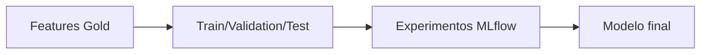

# Hito 3: Modelado y experimentación

## Datos de la entrega

- Asignatura: **DESARROLLO Y DESPLIEGUE DE SOLUCIONES BIG DATA**
- Máster: **Máster Universitario en Big Data y Computación en la Nube**
- Curso académico: **2025-2026**
- Integrantes:
- **Alonso Marcos Muñoz** (`Alonso.Marcos@alu.uclm.es`)
- **JBJOSE Barros Ribademar** (`Jose.Barros1@alu.uclm.es`)
- Fecha de edición de plantilla: **febrero de 2026**

## 1. Objetivo

Entrenar, validar y seleccionar el modelo de churn alineado con los KPIs de negocio.

Fecha objetivo oficial: **17 de abril de 2026**.

## 2. Estructura recomendada

### 2.1 Diseño experimental

- Definición de variable objetivo.
- Ventanas temporales y estrategia de particionado.
- Prevención de data leakage.

### 2.2 Modelos candidatos

- Baseline.
- Modelos avanzados.
- Justificación de elección final.

### 2.3 Métricas técnicas y de negocio

- Recall/Precision/F1/AUC-PR.
- Métricas de campañas de retención.
- Umbrales mínimos para cumplir ROI.

### 2.4 Fairness y robustez

- Equal Opportunity Difference por grupos.
- Análisis por segmentos de cliente.
- Pruebas de estabilidad temporal.

### 2.5 Trazabilidad

- Experimentos en MLflow.
- Versionado de datasets y modelos.

### 2.6 Resultados y decisión

- Comparativa final de modelos.
- Razón de selección para despliegue.

## 3. Diagrama Mermaid pendiente

## 4. Checklist de cierre

- [ ] Protocolo experimental reproducible.
- [ ] Métricas técnicas y negocio validadas.
- [ ] Fairness auditada.
- [ ] Modelo final seleccionado y versionado.
