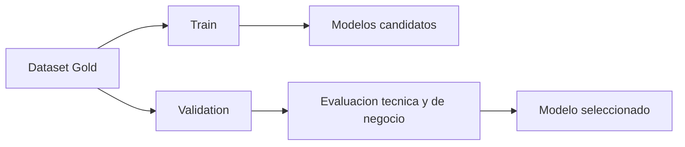

# Hito 3: Modelado y experimentación

## Datos de la entrega

- Asignatura: **DESARROLLO Y DESPLIEGUE DE SOLUCIONES BIG DATA**
- Máster: **Máster Universitario en Big Data y Computación en la Nube**
- Curso académico: **2025-2026**
- Integrantes:
- **Alonso Marcos Muñoz** (`Alonso.Marcos@alu.uclm.es`)
- **Jose Barros Ribademar** (`Jose.Barros1@alu.uclm.es`)
- Fecha prevista del hito: **17 de abril de 2026**

## 1. Objetivo del hito

El objetivo de este hito es entrenar y comparar modelos de churn sobre la base de datos preparada en el Hito 2, seleccionando una versión que sea técnicamente sólida y que esté alineada con los objetivos económicos fijados en el alcance.

## 2. Enfoque de modelado

Vamos a trabajar de forma incremental:

1. Construir una línea base reproducible.
2. Probar mejoras controladas sobre features y algoritmos.
3. Seleccionar el modelo final con criterio técnico y de negocio.

No buscamos el modelo más complejo, sino el más estable y explicable para una primera puesta en producción.

## 3. Diseño experimental

### 3.1 Separación temporal

El particionado será temporal para evitar fuga de información. El entrenamiento utilizará periodos históricos y la validación se realizará en periodos posteriores.

### 3.2 Métricas de evaluación

Métricas principales:

- Recall de clientes con fuga real.
- Precisión en la segmentación de campañas.
- F1 para equilibrar ambas dimensiones.

Métricas de soporte:

- AUC-PR para clases desbalanceadas.
- Comparativa por segmentos de cliente.

### 3.3 Fairness

Incluiremos una revisión de equidad con **Equal Opportunity Difference**, comprobando que la capacidad de detección no penaliza de forma sistemática a un grupo concreto.

## 4. Plan de trabajo

- Semana 1: baseline y validación del pipeline de entrenamiento.
- Semana 2: experimentación de features y tuning acotado.
- Semana 3: análisis de resultados, fairness y elección final.

Reparto:

- Alonso: pipeline de entrenamiento y registro en MLflow.
- Jose: análisis de resultados, comparación de experimentos y selección final.
- Ambos: interpretación de impacto de negocio y redacción del entregable.

## 5. Riesgos y control

- Sobreajuste por exceso de tuning: limitar búsqueda y validar con partición temporal.
- Mejora técnica sin impacto de negocio: usar métricas de campaña además de métricas clásicas.
- Dificultad de explicar el modelo: priorizar modelos interpretables o acompañar con análisis de importancia de variables.

## 6. Resultado esperado del hito

Al cierre del Hito 3 debemos tener un modelo candidato listo para despliegue, con trazabilidad completa de experimentos, métricas justificadas y una decisión técnica defendible en términos de negocio.
