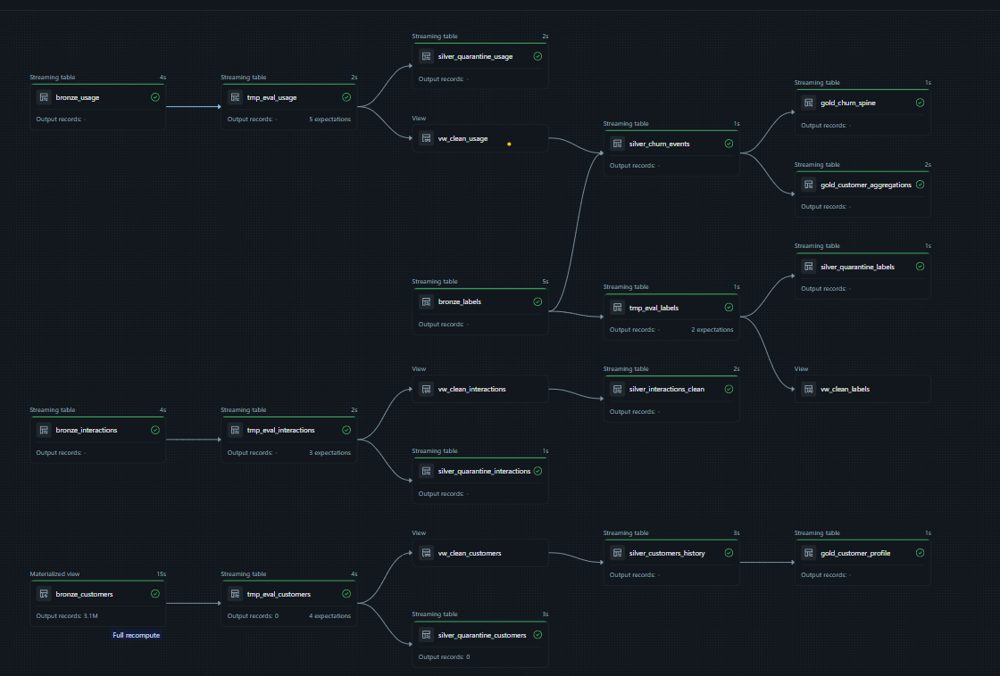
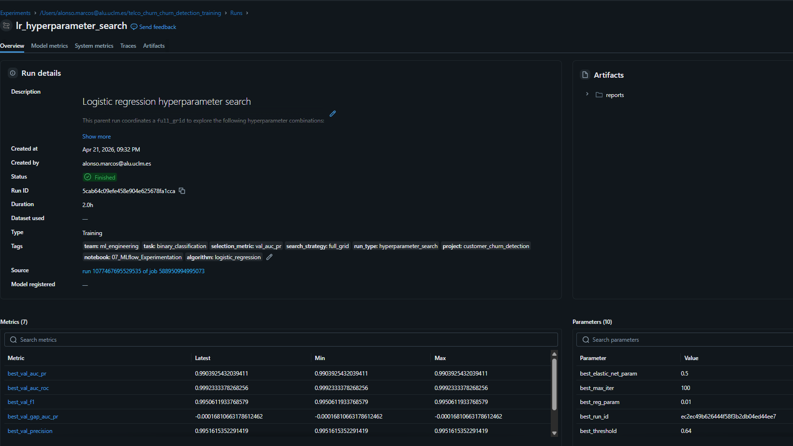
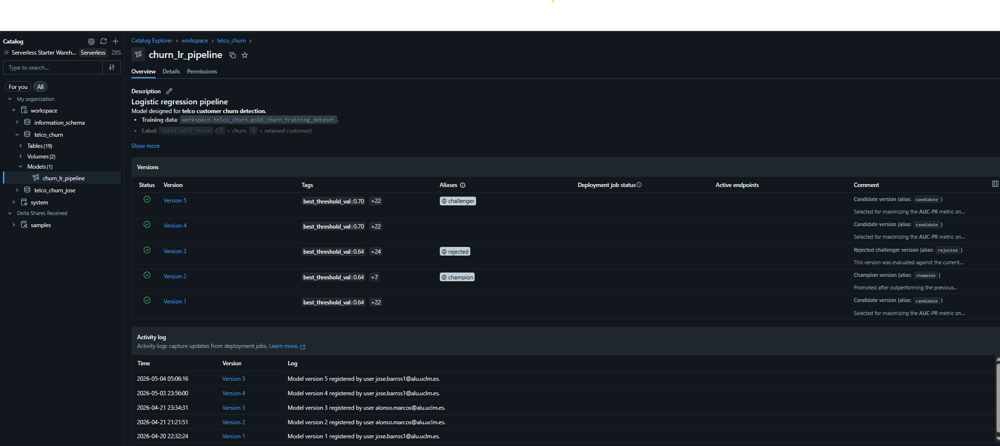
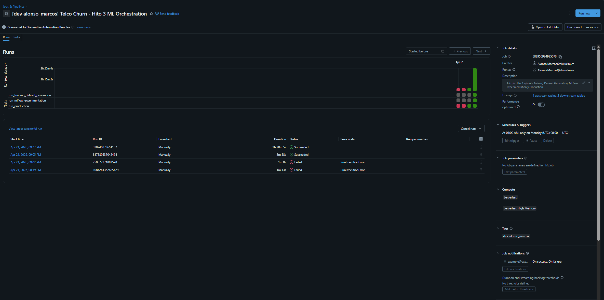
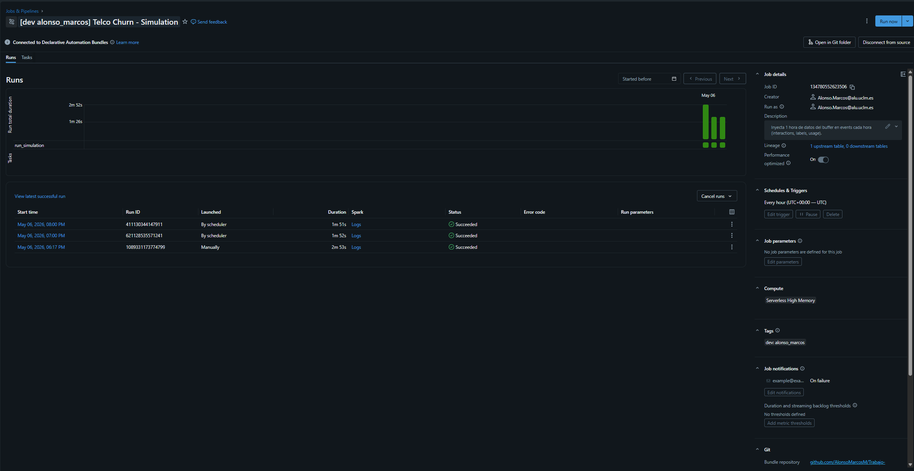
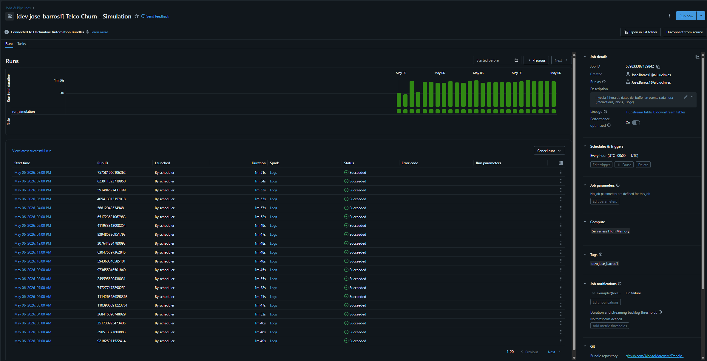
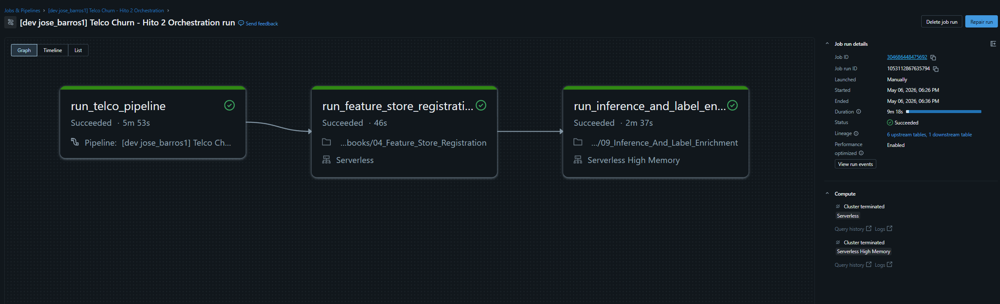
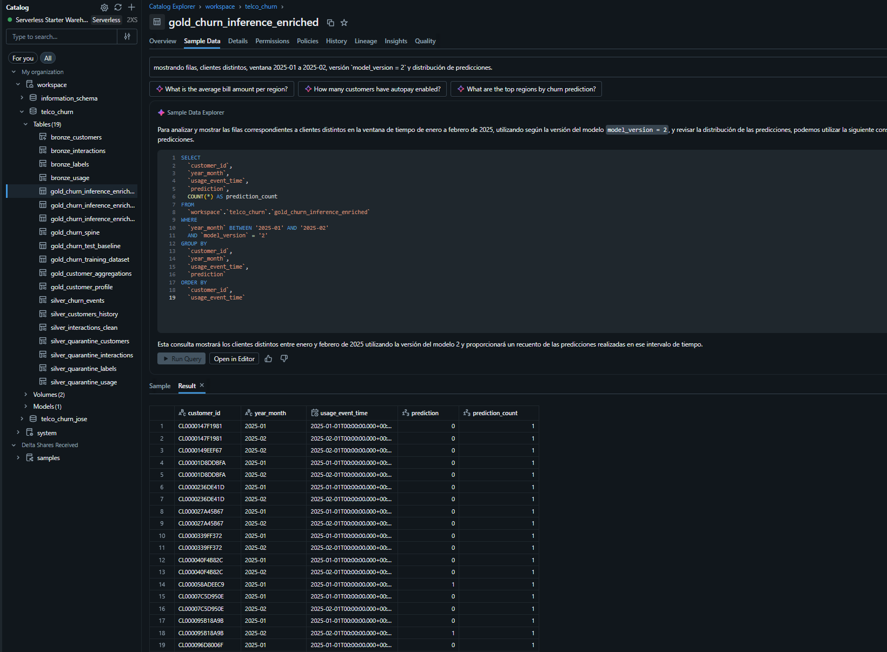
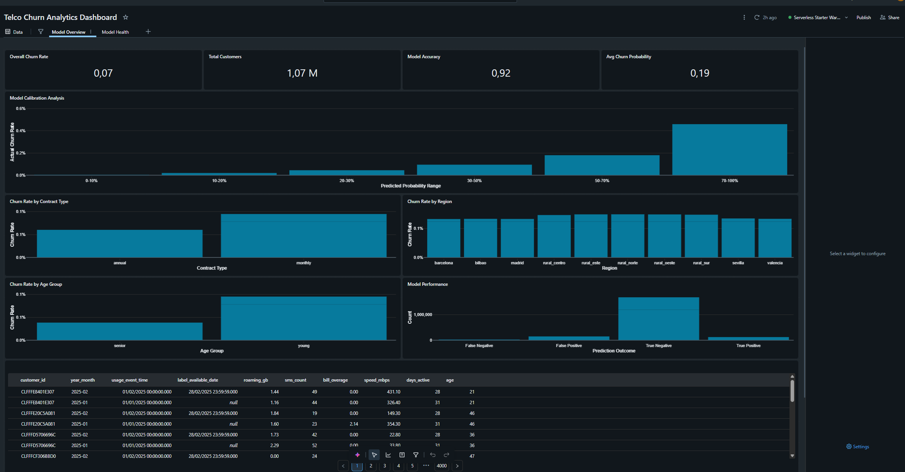
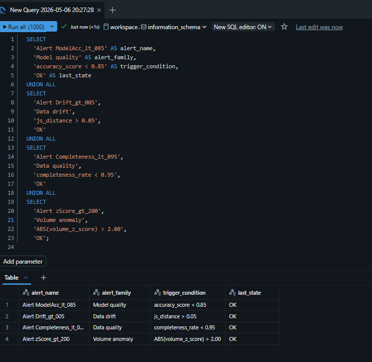

# Memoria técnica incremental del proyecto (Hitos 1, 2, 3 y 4)

## Datos de la entrega

- Asignatura: **Desarrollo y Despliegue de Soluciones Big Data**
- Máster: **Máster Universitario en Big Data y Computación en la Nube**
- Curso académico: **2025-2026**
- Integrantes:
  - Alonso Marcos Muñoz (`Alonso.Marcos@alu.uclm.es`)
  - Jose Barros Ribademar (`Jose.Barros1@alu.uclm.es`)

---

## Hito 1: Alcance y viabilidad

### Introducción del hito

El objetivo de este primer hito es cerrar el alcance del proyecto con una justificación técnica y económica suficiente para sustentar su ejecución durante el resto de la asignatura. En esta fase no se plantea un prototipo parcial, sino una propuesta completa de trabajo que permita defender qué problema de negocio se pretende resolver, por qué una arquitectura de datos distribuida es adecuada y qué condiciones de viabilidad deben cumplirse para que el proyecto sea defendible en términos académicos y profesionales.

La memoria se ha redactado como documento de base para los siguientes hitos, de forma que cada decisión tomada en febrero de 2026 quede trazada con su hipótesis asociada y pueda validarse posteriormente con resultados de implementación. La fecha oficial de cierre del hito es el **27 de febrero de 2026**.

### Alcance y viabilidad

#### Definición del problema de negocio

La empresa de telecomunicaciones analizada gestiona una cartera activa de 2.000.000 de clientes particulares en un mercado muy competitivo. En el escenario de partida se observa una rotación mensual del 3%, equivalente a 60.000 bajas cada mes. Esta dinámica refleja que las campañas generalistas de retención no están siendo suficientes para priorizar a los clientes con mayor probabilidad de abandono y mayor impacto económico.

Desde el punto de vista financiero, el problema se concentra en dos frentes. Por un lado, se estima que 40.000 bajas mensuales son potencialmente recuperables y que cada cliente perdido supone, de media, 100 euros de margen neto anual no capturado. Por otro lado, la compañía aplica descuentos de forma poco precisa sobre una parte de clientes que no presenta riesgo real de fuga, lo que incrementa el coste comercial sin retorno proporcional.

$$
\text{Pérdida por fugas recuperables} = 40.000 \times 100 = 4.000.000\ \text{EUR/mes}
$$

$$
\text{Coste por incentivos mal asignados} = 100.000 \times 10 = 1.000.000\ \text{EUR/mes}
$$

$$
\text{Impacto económico mensual estimado} = 5.000.000\ \text{EUR/mes}
$$

Este volumen de pérdida justifica abordar el problema con una solución analítica que permita identificar mejor el riesgo de churn y mejorar la asignación de incentivos.

#### Análisis y selección de la solución técnica

Para resolver el caso se valoraron tres enfoques: reglas heurísticas, aprendizaje automático en entorno monolítico y arquitectura big data distribuida. El enfoque heurístico ofrece rapidez inicial, pero su mantenimiento crece de forma no lineal al aumentar la casuística y sufre cuando cambian los patrones de comportamiento. El enfoque monolítico con machine learning mejora la capacidad predictiva, aunque introduce limitaciones de escalabilidad, de trazabilidad operativa y de incorporación de nuevas fuentes en escenarios de mayor volumen.

La alternativa distribuida, basada en un pipeline de datos en Databricks con arquitectura medallion, se selecciona porque se ajusta mejor al tamaño de la base de clientes, permite evolucionar el sistema por capas (bronze, silver y gold) y facilita la gobernanza técnica del proyecto. Esta decisión no se fundamenta en complejidad tecnológica por sí misma, sino en su adecuación al problema y en su coherencia con los objetivos formativos de la asignatura.

La justificación big data se apoya sobre varias de las "Vs" vistas en la asignatura, pero aplicadas al caso y no como teoría aislada. La "V" de volumen aparece en los millones de clientes y decenas de millones de eventos mensuales que se materializan después en bronze y silver. La "V" de variedad aparece porque se combinan datos de contexto de cliente, uso, facturación, interacciones y etiquetas de churn, con formatos CSV y JSON y ritmos de llegada distintos. La "V" de veracidad se aborda con reglas de calidad, cuarentena y trazabilidad de fichero de origen. La "V" de velocidad no se interpreta aquí como latencia de milisegundos, porque el negocio no exige decidir en tiempo real, sino como capacidad de actualizar periódicamente lotes grandes de datos sin rehacer manualmente todo el histórico. Esta lectura evita sobredimensionar el problema y explica por qué la solución elegida es batch distribuida y no streaming estricto.

#### Evaluación de la viabilidad

##### Viabilidad técnica

La viabilidad técnica se considera favorable por cuatro motivos. En primer lugar, existe masa crítica de datos para entrenar y evaluar modelos de clasificación supervisada. En segundo lugar, el problema tiene una definición clara de variable objetivo (baja/no baja) y un marco temporal razonable para construir etiquetas y ventanas de observación. En tercer lugar, se dispone de señales potencialmente explicativas, como antigüedad del cliente, uso de servicios, incidencias, facturación e historial de interacción comercial. En cuarto lugar, la ejecución en modo batch reduce el riesgo de implementación temprana y permite priorizar robustez, reproducibilidad y calidad del dato antes de plantear escenarios de inferencia más exigentes.

##### Viabilidad económica

El escenario económico se ha planteado con hipótesis conservadoras para evitar sobreestimar el impacto. Si el sistema consigue reducir un 5% las fugas recuperables y, en paralelo, disminuir un 5% el coste de incentivos mal dirigidos, el beneficio mensual esperado sería de 250.000 euros.

$$
\text{Beneficio por mejora en fugas} = 4.000.000 \times 0{,}05 = 200.000\ \text{EUR/mes}
$$

$$
\text{Beneficio por mejora en incentivos} = 1.000.000 \times 0{,}05 = 50.000\ \text{EUR/mes}
$$

$$
\text{Beneficio total estimado} = 250.000\ \text{EUR/mes}
$$

En cuanto a costes, se considera una carga mensual de 10.000 euros de dedicación técnica y 1.100 euros de infraestructura cloud, lo que sitúa el coste total en 11.100 euros al mes.

$$
\text{ROI mensual} = \left(\frac{250.000 - 11.100}{11.100}\right)\times 100 = 2.152\%
$$

$$
\text{Payback aproximado} = \frac{11.100}{250.000}\times 30 = 1{,}3\ \text{días}
$$

Aunque estos resultados dependen de hipótesis que deberán contrastarse en los hitos de datos y modelado, el orden de magnitud obtenido muestra que el caso tiene sentido económico incluso en un escenario prudente.

##### Viabilidad ética y legal

La propuesta incorpora desde el inicio restricciones de cumplimiento alineadas con RGPD y con buenas prácticas de IA aplicada. Se prevé seudonimización de identificadores, control de accesos sobre datasets sensibles y trazabilidad de transformaciones y versiones de modelo. Además, se incluye evaluación de sesgo mediante métricas de equidad, con el objetivo de detectar desviaciones de rendimiento entre grupos y evitar decisiones comerciales sistemáticamente desfavorables para colectivos concretos.

### Planificación y recursos

#### Objetivos de negocio y traducción técnica

Los objetivos operativos para el proyecto son reducir en un 5% la pérdida asociada a fugas recuperables y reducir en un 5% el coste de incentivos innecesarios. Traducido a magnitudes de seguimiento mensual, esto implica pasar de 40.000 a 38.000 bajas recuperables y de 100.000 a 95.000 incentivos potencialmente mal asignados. En términos técnicos, estos objetivos se transforman en tres líneas de trabajo: mejorar la capacidad de detección temprana del riesgo de churn, aumentar la precisión de segmentación para campañas de retención y mantener estabilidad de pipeline para garantizar repetibilidad de resultados.

#### Organización del equipo

El trabajo se organiza en una estructura colaborativa de dos perfiles complementarios. Una parte se centra en ingeniería de datos y MLOps, abarcando ingesta, control de calidad, orquestación y trazabilidad del pipeline. La otra parte se orienta al modelado, incluyendo construcción de variables, entrenamiento, evaluación y análisis de error. Esta distribución no es rígida; se revisa de forma continua para equilibrar carga y acelerar resolución de incidencias.

#### Fuentes de datos y stack tecnológico

La solución se apoyará en cuatro fuentes funcionales: maestro de clientes, histórico de bajas, registros de uso y facturación, e histórico de campañas con respuesta observada. Sobre estas fuentes se implementará un pipeline en Databricks y Delta Lake, con procesamiento distribuido en Spark, modelado con Spark MLlib y seguimiento experimental mediante MLflow. El control de versiones y la coordinación del desarrollo se mantienen en GitHub para preservar trazabilidad técnica y facilitar auditoría del trabajo.

#### Cronograma oficial del proyecto

El calendario de la asignatura queda estructurado en cuatro hitos consecutivos: Hito 1 (Alcance y viabilidad) del 24/02/2026 al 27/02/2026; Hito 2 (Preparación y gestión de datos) del 28/02/2026 al 20/03/2026; Hito 3 (Modelado y experimentación) del 21/03/2026 al 17/04/2026; y Hito 4 (Despliegue y monitorización) del 18/04/2026 al 01/05/2026. La planificación del presente documento está alineada con ese marco oficial.

### Cierre del Hito 1

Con este hito queda definido un alcance técnicamente consistente y económicamente justificado para el proyecto de churn telco. La propuesta establece el problema de negocio, argumenta la elección arquitectónica, delimita condiciones de viabilidad y fija objetivos medibles para los siguientes entregables. El siguiente paso es ejecutar el Hito 2 con foco en preparación del dato, validación de calidad y materialización del pipeline medallion en el entorno de trabajo.

---

## Hito 2: Preparación y gestión de datos

### Objetivo del hito

El objetivo real de este segundo hito ha sido pasar del diseño conceptual del Hito 1 a una implementación de datos que funcione de verdad en Databricks, con ejecución completa y repetible. En otras palabras, no se trataba solo de “tener scripts”, sino de validar que el proyecto podía desplegarse, correr sin intervención manual y dejar un resultado coherente para el inicio de Hito 3.

Para conseguirlo, el trabajo se organizó como un proceso incremental: primero estabilizamos el entorno de ejecución y el bundle, después cerramos la arquitectura medallion por capas, y finalmente incorporamos orquestación tipo producción (pipeline + notebook final), siguiendo el patrón del proyecto de referencia del profesor pero adaptado a nuestra temática de churn telco. La arquitectura medallion no se entiende aquí como una nomenclatura decorativa, sino como una forma de separar responsabilidades: bronze conserva el dato crudo y auditable, silver aplica calidad y normalización, y gold contiene entidades ya preparadas para analítica y machine learning. Esta separación permite explicar dónde se corrige un problema sin mezclar ingesta, reglas de negocio y variables de modelado en el mismo bloque de código.

### Implementación en Databricks

La implementación se articula en torno a Databricks Asset Bundles:

- `codigo/databricks.yml` como punto de entrada de configuración.
- `codigo/resources/telco_churn.pipeline.yml` para la definición del pipeline medallion.
- `codigo/resources/telco_churn_orchestration.job.yml` para la orquestación diaria de datos e inferencia.
- `codigo/resources/telco_churn_ml_orchestration.job.yml` para la orquestación de modelado de Hito 3.
- `codigo/resources/telco_churn_simulation.job.yml` para la simulación horaria de datos de producción.

Una decisión importante de esta fase fue consolidar un único workspace operativo para evitar límites de cuota y problemas de permisos del entorno inicial. Sobre ese workspace se normalizó la capa de gobierno en Unity Catalog con una estructura explícita y descriptiva:

- Catálogo: `workspace`
- Esquema operativo del proyecto: `workspace.telco_churn`
- Volumen de entrada: volumen UC `landing_zone` dentro de `workspace.telco_churn`

Además de la estructura, se añadieron descripciones visibles en catálogo, esquema, volumen y pipeline para que cualquier miembro del equipo pueda entender rápidamente qué recurso es oficial y cuál no, directamente desde la UI de Databricks, sin tener que abrir código local.

Durante la fase de despliegue apareció una incidencia crítica de operativa (`413 Request Entity Too Large`) al intentar sincronizar datos masivos junto con el bundle. La solución fue separar de forma estricta “código versionable” y “artefacto generado”, excluyendo del `sync` las salidas generadas por el simulador y los logs de generación. Este ajuste fue clave para estabilizar `validate/deploy` y dejar un flujo reproducible para ambos integrantes del equipo.

### Fuentes de datos y ventana temporal

La generación de datos sintéticos se realiza con `codigo/src/medallion_pipeline/utilities/generate.py`. Este script crea el maestro de clientes, los eventos mensuales de uso, interacciones y etiquetas, y una zona adicional de producción simulada para datos de 2025 con deriva.

En la práctica, el script genera un volumen de información suficientemente grande para tensionar la ejecución en Free Edition y obligar a tomar decisiones técnicas reales de rendimiento. Esto era un objetivo del hito: demostrar un escenario cercano a Big Data, no un ejemplo mínimo.

Desde el punto de vista temporal, en Hito 2 se decidió mantener una frontera clara entre histórico y producción simulada:

- La zona histórica de eventos se trata como base de entrenamiento (2023-2024).
- La zona de producción simulada se conserva como bloque de 2025 con deriva, útil para validación temporal posterior.

Esta separación evita mezclar periodos sin control y deja preparado el terreno para un Hito 3 metodológicamente correcto, especialmente en lo relativo a fuga temporal de información.

### Arquitectura medallion ejecutada

A continuación se describe cada capa por separado para que quede claro qué responsabilidad tiene, qué tablas materializa y qué datos contiene cada salida. Los recuentos indicados corresponden a la carga histórica usada en Hito 2: maestro de clientes y eventos de 2023-2024. Los datos de 2025 se mantienen como producción simulada con deriva y no entran automáticamente en estas tablas si no se amplía la ingesta.

#### Capa bronze: ingesta y trazabilidad

La capa bronze se implementa en `codigo/src/medallion_pipeline/transformations/01_bronze_ingestion.py`. Su responsabilidad es conservar el dato de entrada con la mínima transformación posible y añadir metadatos técnicos de auditoría. El maestro de clientes se lee como batch porque es una fotografía de contexto, mientras que uso, etiquetas e interacciones se ingieren con Auto Loader en modo incremental. Auto Loader es relevante porque permite descubrir ficheros nuevos en la landing zone sin listar manualmente todos los directorios ni reingerir el histórico completo; en nuestro caso encaja con la llegada particionada por año y mes de los eventos JSON.

| Tabla materializada | Filas | Columnas generadas | Contenido |
|---------------------|------:|--------------------|-----------|
| `bronze_customers` | 3.050.000 | `customer_id`, `customer_updated_at`, `age`, `gender`, `contract_type`, `region`, `region_type`, `tariff_plan`, `monthly_fee`, `num_lines`, `device_type`, `acquisition_channel`, `payment_method`, `signup_date`, `has_tv_bundle`, `has_fiber`, `has_roaming`, `paperless_billing`, `autopay`, `nps_score_at_start`, `is_active`, `ingestion_timestamp`, `source_file` | Maestro de clientes sintético. Mantiene atributos demográficos, contractuales, comerciales y de facturación, más trazabilidad de ingesta. |
| `bronze_usage` | 32.121.558 | `bill_amount`, `bill_overage`, `call_minutes`, `coverage_score`, `customer_id`, `data_consumed_gb`, `days_active`, `days_payment_late`, `nps_score`, `roaming_gb`, `sms_count`, `speed_mbps`, `tariff_plan`, `year_month`, `_rescued_data`, `ingestion_timestamp`, `source_file` | Eventos mensuales de uso y facturación por cliente durante 2023-2024. Es la principal fuente de señales dinámicas para churn. |
| `bronze_labels` | 32.121.558 | `churn_date`, `customer_id`, `label_available_date`, `year_month`, `_rescued_data`, `ingestion_timestamp`, `source_file` | Etiquetas mensuales de churn disponibles al cierre de cada mes. Permiten construir la variable objetivo sin mezclarla con el maestro de clientes. |
| `bronze_interactions` | 17.021.772 | `agent_id`, `channel`, `customer_id`, `duration_seconds`, `interaction_type`, `resolution`, `satisfaction_score`, `timestamp`, `_rescued_data`, `ingestion_timestamp`, `source_file` | Eventos de relación con el cliente: llamadas, chats, visitas, reclamaciones, soporte técnico y señales comerciales. |

La columna `_rescued_data` aparece en las tablas JSON gestionadas por Auto Loader y permite conservar campos inesperados sin romper la ejecución. Esta columna es útil en escenarios reales porque un proveedor puede añadir un campo nuevo o cambiar parcialmente el esquema; si el pipeline falla ante cualquier variación menor, la operación se vuelve frágil. En todas las salidas se añaden `ingestion_timestamp` y `source_file` para auditar cuándo y desde qué fichero se incorporó cada registro.

#### Capa silver: calidad, historial y entidades limpias

La capa silver se implementa en `codigo/src/medallion_pipeline/transformations/02_silver_transformation.py` con reglas centralizadas en `codigo/src/medallion_pipeline/rules/customers.py`. Su función es separar registros válidos y no válidos, normalizar tipos temporales y construir entidades coherentes para explotación analítica. En esta capa se aplica la idea de cuarentena o DLQ (dead letter queue): un registro defectuoso no se elimina sin explicación, sino que se aparta para inspección y se evita que contamine las agregaciones posteriores.

| Tabla materializada | Filas | Columnas generadas | Contenido |
|---------------------|------:|--------------------|-----------|
| `silver_customers_history` | 3.050.000 | `customer_id`, `customer_updated_at`, `age`, `gender`, `contract_type`, `region`, `region_type`, `tariff_plan`, `monthly_fee`, `num_lines`, `device_type`, `acquisition_channel`, `payment_method`, `signup_date`, `has_tv_bundle`, `has_fiber`, `has_roaming`, `paperless_billing`, `autopay`, `nps_score_at_start`, `is_active`, `__START_AT`, `__END_AT` | Historial SCD2 del maestro de clientes mediante AUTO CDC. En Hito 2 hay una versión por cliente porque se parte de una única fotografía de contexto. |
| `silver_churn_events` | 32.121.558 | `bill_amount`, `bill_overage`, `call_minutes`, `coverage_score`, `customer_id`, `data_consumed_gb`, `days_active`, `days_payment_late`, `nps_score`, `roaming_gb`, `sms_count`, `speed_mbps`, `tariff_plan`, `year_month`, `_rescued_data`, `ingestion_timestamp`, `source_file`, `usage_event_time`, `churn_date`, `label_available_date` | Eventos de uso limpios enriquecidos con la etiqueta mensual de churn. Mantiene una fila por cliente y mes, por eso conserva la cardinalidad de `bronze_usage`. |
| `silver_interactions_clean` | 17.021.772 | `agent_id`, `channel`, `customer_id`, `duration_seconds`, `interaction_type`, `resolution`, `satisfaction_score`, `timestamp`, `_rescued_data`, `ingestion_timestamp`, `source_file` | Interacciones válidas con `timestamp` convertido a tipo temporal y dominio de `interaction_type` validado. |
| `silver_quarantine_customers` | 0 | Columnas de `bronze_customers` más `customer_sequence_at` | Registros de clientes que no superan las reglas de identificador, edad, contrato o tarifa. En la carga de Hito 2 no se generaron incumplimientos. |
| `silver_quarantine_usage` | 0 | Mismas columnas que `bronze_usage` | Registros de uso con identificador, periodo o métricas numéricas inválidas. La tabla queda creada aunque no haya registros rechazados. |
| `silver_quarantine_labels` | 0 | `churn_date`, `customer_id`, `label_available_date`, `year_month`, `_rescued_data`, `ingestion_timestamp`, `source_file` | Etiquetas sin cliente o sin periodo válido. En la carga histórica no se detectaron casos. |
| `silver_quarantine_interactions` | 0 | Mismas columnas que `silver_interactions_clean` | Interacciones sin cliente, sin timestamp o con tipo de interacción fuera del dominio controlado. |

El uso de tablas de cuarentena evita descartar silenciosamente datos defectuosos y, al mismo tiempo, impide que registros inválidos contaminen la capa gold. Que las cuarentenas tengan cero filas en esta ejecución no significa que el mecanismo no exista; significa que el generador entregó datos compatibles con las reglas definidas para Hito 2. Esta diferencia es importante documentalmente: una capa de calidad no se valida solo por rechazar datos, sino por dejar explícito qué reglas se comprueban y dónde aparecerían los rechazos si una fuente empezase a enviar valores fuera de dominio.

#### Capa gold: base de modelado y características

La capa gold se reparte en tres scripts, igual que en el proyecto de referencia del profesor, donde la capa final se separa en spine, perfil y variables derivadas. En nuestro caso se mantiene la misma idea, pero adaptada al problema de churn telco:

- `03_gold_churn_spine.py` genera `gold_churn_spine`.
- `03_gold_customer_profile.py` genera `gold_customer_profile`.
- `03_gold_customer_aggregations.py` genera `gold_customer_aggregations`.

| Tabla materializada | Filas | Columnas generadas | Contenido |
|---------------------|------:|--------------------|-----------|
| `gold_churn_spine` | 32.121.558 | `customer_id`, `year_month`, `usage_event_time`, `label_available_date`, `churn_date`, `label_will_churn`, `roaming_gb`, `sms_count`, `bill_overage`, `speed_mbps`, `days_active` | Tabla ancla para modelado supervisado. Contiene la clave cliente-mes, la fecha de disponibilidad de etiqueta, la variable objetivo binaria y señales de uso disponibles en el evento. |
| `gold_customer_profile` | 3.050.000 | `customer_id`, `age`, `gender`, `contract_type`, `region`, `region_type`, `tariff_plan`, `monthly_fee`, `num_lines`, `device_type`, `acquisition_channel`, `payment_method`, `signup_date`, `has_tv_bundle`, `has_fiber`, `has_roaming`, `paperless_billing`, `autopay`, `nps_score_at_start`, `is_active`, `__START_AT`, `__END_AT`, `age_group`, `contract_risk_group` | Perfil estable del cliente con atributos demográficos, contractuales y dos derivadas simples para segmentación: grupo de edad y grupo de riesgo contractual. |
| `gold_customer_aggregations` | 32.121.558 | `customer_id`, `year_month`, `window_end`, `label_available_date`, `label_will_churn`, `data_consumed_gb`, `call_minutes`, `bill_amount`, `days_payment_late`, `nps_score`, `coverage_score`, `bill_vs_data_ratio` | Features mensuales por cliente. Conserva métricas de uso, facturación, satisfacción y cobertura, y añade el ratio `bill_vs_data_ratio` para aproximar coste relativo por consumo. |

Las tablas `gold_customer_profile` y `gold_customer_aggregations` se declaran con propiedades compatibles con Change Data Feed y claves temporales, de forma que puedan registrarse posteriormente como tablas de características en Unity Catalog y publicarse en Online Feature Store cuando el entorno académico permita Lakebase. Change Data Feed permite leer qué filas han cambiado entre versiones Delta, lo que es útil para refrescos incrementales y para no recalcular siempre tablas completas. En Hito 2 esta parte queda preparada a nivel de contrato de datos; el entrenamiento y la selección final de variables se abordan en Hito 3.

### Control de calidad - Capa Silver

#### Centralización de reglas

Las reglas de calidad se centralizan en `codigo/src/medallion_pipeline/rules/customers.py` para evitar lógica duplicada y facilitar la revisión funcional. Esta centralización simplifica el mantenimiento: cuando una regla cambia, la actualización se realiza en un único punto y se propaga automáticamente al flujo completo. Cada regla es una expresión SQL que debe evaluar a `TRUE` para que un registro se considere válido; los registros que no la superan son marcados con el flag `is_quarantined` en lugar de descartados, preservando trazabilidad.

---

#### Reglas por entidad

##### Clientes (`get_customer_rules`)

La entidad de clientes es el eje central del modelo de churn. Sus reglas buscan garantizar que cada registro represente a un cliente real e identificable, con datos de contrato y facturación coherentes.

| Regla | Expresión SQL | Justificación |
|-------|---------------|---------------|
| `valid_customer_id` | `customer_id IS NOT NULL` | Sin identificador no es posible vincular el registro con ninguna otra entidad del modelo. Es la clave de integridad referencial del sistema. |
| `valid_age` | `age > 0 AND age < 120` | Filtra edades biológicamente imposibles originadas por errores de ingesta o valores por defecto. El rango 1–119 cubre la totalidad de clientes reales posibles. |
| `valid_contract_type` | `contract_type IN ('monthly', 'annual')` | El tipo de contrato determina la lógica de cálculo de churn. Valores fuera del dominio conocido indicarían un error de codificación upstream que podría distorsionar los modelos. |
| `valid_monthly_fee` | `monthly_fee >= 0` | Una tarifa negativa es económicamente incoherente y señala un error de transformación. Se permite el valor cero para cubrir planes gratuitos o promociónales. |

---

##### Uso (`get_usage_rules`)

Los registros de uso son la principal fuente de señal de comportamiento del cliente. La calidad en esta entidad es crítica porque sus valores alimentan directamente las features del modelo predictivo.

| Regla | Expresión SQL | Justificación |
|-------|---------------|---------------|
| `valid_customer_id` | `customer_id IS NOT NULL` | Necesario para asociar el consumo a un cliente concreto. Sin él el registro es inutilizable para el análisis. |
| `valid_year_month` | `year_month IS NOT NULL` | El período de referencia es imprescindible para la agregación mensual y la construcción de la ventana temporal del modelo. |
| `valid_data_consumed` | `data_consumed_gb >= 0` | El consumo de datos no puede ser negativo. Valores negativos apuntan a errores de medición o reversiones mal registradas. |
| `valid_call_minutes` | `call_minutes >= 0` | Análogamente, los minutos de llamada son una magnitud no negativa. Un valor negativo indicaría un error en el sistema de medición. |
| `valid_bill_amount` | `bill_amount >= 0` | El importe facturado debe ser cero o positivo. Importes negativos pueden deberse a abonos incorrectamente clasificados que contaminarían los ratios de facturación. |

---

##### Etiquetas (`get_label_rules`)

Las etiquetas representan la variable objetivo del modelo de churn. Su integridad es especialmente sensible: un error aquí no degrada la calidad del dato sino directamente la del entrenamiento.

| Regla | Expresión SQL | Justificación |
|-------|---------------|---------------|
| `valid_customer_id` | `customer_id IS NOT NULL` | Una etiqueta sin cliente asociado no puede incorporarse al dataset de entrenamiento ni de evaluación. |
| `valid_year_month` | `year_month IS NOT NULL` | La etiqueta de churn es inherentemente temporal. Sin período de referencia no es posible alinearla con las features del mes correspondiente. |

---

##### Interacciones (`get_interaction_rules`)

Los eventos de interacción enriquecen el perfil del cliente con señales de comportamiento cualitativo. La validación se centra en la coherencia del tipo de interacción, ya que determina cómo se agregan y ponderan los eventos en la capa gold.

| Regla | Expresión SQL | Justificación |
|-------|---------------|---------------|
| `valid_customer_id` | `customer_id IS NOT NULL` | Sin cliente identificado la interacción no puede vincularse al historial correspondiente. |
| `valid_timestamp` | `timestamp IS NOT NULL` | La ordenación temporal de las interacciones es necesaria para construir features de recencia y frecuencia. Sin timestamp el evento pierde su dimensión temporal. |
| `valid_interaction_type` | `interaction_type IN (...)` | El tipo de interacción está codificado en un dominio cerrado de 13 valores. Cualquier valor fuera de este dominio indica un error de integración upstream y podría introducir categorías espurias en el modelo. |

---

### Robustez y resolución de incidencias

La robustez del Hito 2 no se plantea como una lista de errores internos de desarrollo, sino como un conjunto de decisiones concretas de ingeniería y operación que hacen reproducible el pipeline:

- Separación estricta entre código versionable y datos generados. Las salidas masivas del generador y sus logs se excluyen del bundle para que `validate` y `deploy` no intenten sincronizar artefactos pesados.
- Imports robustos para ejecución en Databricks. Las reglas de calidad viven en `src/medallion_pipeline/rules/` y se cargan desde el `bundle.sourcePath` inyectado por el pipeline, manteniendo la separación entre reglas y transformaciones.
- Capa silver con cuarentena explícita. Cada entidad tiene un flujo de evaluación y una tabla de cuarentena, lo que permite que el pipeline siga siendo trazable aunque en futuras cargas aparezcan registros inválidos.
- Enriquecimiento de eventos con patrón stream-static. Para Hito 2 se mantiene `bronze_usage` como flujo incremental y se cruza con una vista estática de etiquetas mensuales válidas. Esta decisión es suficiente para una carga histórica mensual y reduce complejidad operativa frente a un join stream-stream completo.
- Ejecución en modo triggered. El pipeline no queda ejecutándose de forma continua; se lanza bajo demanda o desde el job, procesa el lote disponible y libera recursos. Esto encaja con la entrega académica y con la generación mensual de datos.

Con estos ajustes, la evidencia relevante es el resultado final: actualización completa en estado `COMPLETED`, tablas materializadas por capa y contrato de datos preparado para modelado.

### Orquestación final del hito

Con la capa de datos estabilizada, cerramos el hito incorporando un job final de orquestación, equivalente en estructura al del proyecto de referencia:

- Job: `Telco Churn - Hito 2 Orchestration`
- Secuencia:
  1. Ejecución de pipeline Medallion
  2. Ejecución del notebook `codigo/notebooks/04_Feature_Store_Registration.py`

El notebook final se incorporó en `codigo/notebooks` y se adaptó para ejecución en modo simulación de Feature Store, ya que Free Edition no permite desplegar Lakebase/Online Feature Store. Aun así, el notebook valida la existencia de tablas gold, registra trazas de ejecución y conserva comentado el bloque de código real para activar en cuanto haya licencia.

También se configuraron notificaciones de éxito y error en el propio job para ambos integrantes del equipo, de forma que la ejecución quede monitorizada sin necesidad de revisar manualmente la UI en cada corrida.

### Decisiones de limpieza y gobierno del entorno

Como parte del cierre del hito se realizó limpieza de recursos antiguos para evitar duplicidades y confusión operativa. Se eliminaron volumen y objetos del esquema previo ya en desuso, manteniendo únicamente los recursos oficiales del proyecto en `workspace.telco_churn`.

Esta parte, aunque no cambia el resultado analítico, sí mejora la mantenibilidad del entorno: reduce riesgo de ejecutar sobre tablas antiguas y simplifica la explicación del proyecto durante defensa.

### Estado de cierre del Hito 2

El cierre técnico queda validado con:

- Pipeline en estado `COMPLETED` (update final validada: `aae8711c-6d5f-4502-b237-41f6b738c0e6`)
- Job de orquestación ejecutado en `SUCCESS` (`run_id`: `640253146512278`)
- Tablas medallion materializadas en `workspace.telco_churn`
- Recursos antiguos del esquema previo limpiados para evitar ambigüedad operativa

El DAG resultante refleja la linaje completa del pipeline, desde la ingesta en bronze hasta las tablas gold, con todas las tablas en estado `COMPLETED` y los flujos de cuarentena activos por entidad.

Figura 1. Pipeline Medallion desplegado en Databricks para Hito 2. La captura muestra el grafo de tablas bronze, silver y gold, junto con el estado correcto de la actualización.

En términos académicos y técnicos, el objetivo del hito se considera cumplido: no solo existe código, sino una solución desplegada, ejecutada y trazable, con documentación reproducible tanto por CLI como por UI. Por tanto, Hito 2 queda cerrado con una base de datos estable y gobernada para iniciar Hito 3 sin rehacer ingeniería de datos.

## Hito 3: Modelado y experimentación

### Objetivo del hito

El tercer hito convierte la base de datos gobernada del Hito 2 en un ciclo de modelado reproducible para predicción de churn. El objetivo no es únicamente entrenar un clasificador, sino dejar trazado el proceso completo: generación del dataset de entrenamiento con garantías temporales, experimentación con MLflow, registro del mejor candidato en Unity Catalog y evaluación champion-challenger antes de aceptar o rechazar un modelo.

La guía oficial separa esta fase del pipeline declarativo Medallion. Por tanto, el código de datos sigue viviendo en `src/medallion_pipeline/transformations/` y el modelado se ejecuta como un flujo independiente orquestado mediante un Job de Databricks. No se ha añadido la lógica de ML a `resources/telco_churn.pipeline.yml` porque ese recurso define el pipeline de datos; forzar ahí el entrenamiento rompería la separación recomendada entre ingeniería de datos y MLOps.

### Componentes implementados

La fase de modelado se ha diseñado alrededor de cuatro decisiones específicas del caso de churn telco. La primera es que la unidad de predicción sea el par cliente-mes, no el cliente aislado: cada fila representa el estado observable de un cliente en un mes concreto y permite decidir si debe entrar o no en una campaña de retención. La segunda es que todas las variables se calculen con clave temporal (`usage_event_time`), de forma que el entrenamiento reproduce la información que habría estado disponible en una ejecución real.

La tercera decisión es usar un modelo distribuido de Spark MLlib empaquetado como pipeline completo. Esto evita entrenar el preprocesado por separado y reduce el riesgo de diferencias entre entrenamiento, validación, prueba e inferencia. En términos de MLOps, ese riesgo se conoce como `training-serving skew`: el modelo parece correcto durante entrenamiento, pero en producción recibe variables calculadas de otra forma o con otro esquema. La cuarta decisión es gobernar el resultado con MLflow y Unity Catalog: cada ciclo deja trazados datos, parámetros, métricas, artefactos y aliases (`candidate`, `challenger`, `champion` o `rejected`) para que el modelo aceptado pueda auditarse.

Operativamente, estas decisiones se orquestan en un job de Databricks con tres pasos: regenerar el dataset supervisado desde las tablas gold, ejecutar la búsqueda de hiperparámetros y aplicar el ciclo de promoción. Lo relevante es que el flujo completo es repetible y mantiene separada la fase de datos del pipeline Medallion del Hito 2.

### Generación del dataset de entrenamiento

El dataset de entrenamiento se construye desde la tabla spine `workspace.telco_churn.gold_churn_spine` y se enriquece con las tablas `gold_customer_profile` y `gold_customer_aggregations`. La unión usa claves temporales para que las características correspondan al estado disponible en el momento de predicción (`usage_event_time`), evitando fuga de información futura. Esta lógica es el point-in-time join: para cada cliente y mes no se toma "el último dato disponible hoy", sino el dato que habría sido visible en aquella fecha. Sin esta precaución, el modelo podría aprender señales posteriores a la baja y las métricas quedarían artificialmente infladas.

Las columnas `churn_date` y `label_available_date` se excluyen del dataset materializado porque no estarían disponibles como señales reales de inferencia. La tabla resultante se guarda como Delta estática en `workspace.telco_churn.gold_churn_training_dataset`, con propiedades de trazabilidad:

| Propiedad | Valor validado |
|---|---:|
| `ml.delta_semantic_version` | `0` |
| `ml.delta_physical_version` | `12` |
| `ml.data_max_date` | `2024-12-01` |
| `ml.data_previous_max_date` | vacío en el primer ciclo |
| `ml.num_rows` | `16.316.445` |
| `ml.num_features` | `33` |

La comprobación de calidad confirma que el dataset contiene `16.316.445` filas, `2.042.162` clientes distintos y ventana temporal de `2023-07-01` a `2024-12-01`. No se detectaron nulos en las columnas materializadas. El balance global es de `788.672` filas con churn (`4,83%`) y `15.527.773` sin churn (`95,17%`), por lo que el problema queda desbalanceado y justifica el uso de pesos inversos de frecuencia en el clasificador.

La partición temporal validada fue:

| Split | Periodo | Filas | % del dataset | Churn | No churn | % churn |
|---|---|---:|---:|---:|---:|---:|
| Entrenamiento | 2023-07-01 a 2024-06-30 | 9.900.403 | 60,68% | 508.454 | 9.391.949 | 5,14% |
| Validación | 2024-07-01 a 2024-09-30 | 3.262.300 | 19,99% | 144.869 | 3.117.431 | 4,44% |
| Prueba | 2024-10-01 a 2024-12-01 | 3.153.742 | 19,33% | 135.349 | 3.018.393 | 4,29% |

La distribución deja aproximadamente un 60% de observaciones para ajustar el modelo y dos bloques cercanos al 20% para validación y prueba. Esta proporción es adecuada para el tamaño del dataset: el entrenamiento conserva volumen suficiente para aprender patrones generales, mientras que validación y prueba mantienen millones de observaciones y una cantidad suficiente de casos positivos para estimar AUC-PR y F1 con estabilidad.

### Arquitectura del pipeline de modelado

El modelo se empaqueta como un único `Pipeline` de Spark MLlib para que el preprocesado aprendido durante entrenamiento se aplique de forma idéntica en validación, prueba y producción. Esta decisión evita divergencias entre entrenamiento e inferencia.

Las etapas principales son:

1. Imputación con mediana para variables numéricas.
2. Conversión de indicadores booleanos/binarios.
3. Ingeniería de variables derivadas disponibles en inferencia, como `tenure_months`, `is_high_bill`, `is_late_payer`, `low_nps_flag` y `bill_vs_data_ratio`.
4. Indexación de categóricas con `StringIndexer`.
5. Codificación `OneHotEncoder`.
6. Ensamblado en vector de características.
7. Selección por varianza con `VarianceThresholdSelector`.
8. Escalado estándar.
9. Clasificación con `LogisticRegression`.

Se eligió regresión logística porque ofrece una primera línea base robusta, interpretable y razonable para el volumen de datos disponible. En un proyecto de retención, la explicabilidad del modelo es relevante: no basta con maximizar métricas, también conviene entender qué señales elevan el riesgo de fuga para poder diseñar acciones comerciales.

### Experimentación con MLflow

La experimentación se ejecutó como búsqueda completa sobre ocho configuraciones. En MLflow se registraron métricas tanto en entrenamiento como en validación para revisar rendimiento y posible sobreajuste:

| `reg_param` | `elastic_net_param` | `max_iter` | AUC-PR train | AUC-ROC train | F1 train | AUC-PR validación | AUC-ROC validación | F1 validación | Umbral |
|---:|---:|---:|---:|---:|---:|---:|---:|---:|---:|
| 0.01 | 0.0 | 100 | 0.988688 | 0.998932 | 0.992246 | 0.988422 | 0.999053 | 0.993917 | 0.68 |
| 0.01 | 0.0 | 200 | 0.988688 | 0.998932 | 0.992246 | 0.988422 | 0.999053 | 0.993917 | 0.68 |
| 0.01 | 0.5 | 100 | 0.990224 | 0.999084 | 0.993554 | 0.990393 | 0.999233 | 0.995061 | 0.64 |
| 0.01 | 0.5 | 200 | 0.990225 | 0.999084 | 0.993554 | 0.990393 | 0.999233 | 0.995061 | 0.64 |
| 0.1 | 0.0 | 100 | 0.967972 | 0.996364 | 0.988957 | 0.966975 | 0.996650 | 0.990864 | 0.61 |
| 0.1 | 0.0 | 200 | 0.967972 | 0.996364 | 0.988957 | 0.966975 | 0.996650 | 0.990864 | 0.61 |
| 0.1 | 0.5 | 100 | 0.963315 | 0.993697 | 0.991321 | 0.964275 | 0.994287 | 0.992659 | 0.55 |
| 0.1 | 0.5 | 200 | 0.963315 | 0.993697 | 0.991321 | 0.964274 | 0.994287 | 0.992659 | 0.55 |

La métrica primaria fue AUC-PR, más adecuada que accuracy o AUC-ROC cuando la clase positiva es minoritaria. En este proyecto el churn representa menos del 5% del dataset de entrenamiento, de modo que una métrica como accuracy puede parecer alta aunque el modelo apenas detecte clientes que se van. AUC-PR resume la relación entre precisión y recall sobre la clase positiva, que es precisamente la que activa una posible campaña de retención. El mejor modelo fue la configuración `reg_param = 0.01`, `elastic_net_param = 0.5` y `max_iter = 100`, con AUC-PR de validación `0.990393`, AUC-ROC `0.999233`, F1 `0.995061`, precisión `0.995162`, recall `0.995007` y umbral óptimo `0.64`.

El resultado en entrenamiento de ese mismo modelo fue AUC-PR `0.990224`, AUC-ROC `0.999084` y F1 `0.993554`. La diferencia de AUC-PR entre entrenamiento y validación fue prácticamente nula (`-0,000168`), por lo que no observamos señales de sobreajuste relevante en esta primera línea base. El incremento de `max_iter` de 100 a 200 no aportó mejora material, así que se mantuvo la configuración más simple.

El experimento quedó registrado en MLflow en:

- Experimento: `telco_churn_churn_detection_training`, creado en el espacio de usuario de Alonso
- Parent run: `5cab64c09efe458e904e625678fa1cca`
- Mejor run: `ec2ec49b626444f58f3b2db04ed44ee7`
- Modelo registrado: `workspace.telco_churn.churn_lr_pipeline`

Figura 2. Experimento MLflow `telco_churn_churn_detection_training`, con los runs de búsqueda de hiperparámetros y métricas de evaluación como AUC-PR, AUC-ROC y F1.

### Registro en Unity Catalog y ciclo champion-challenger

El modelo se gobierna con aliases de Unity Catalog. El primer despliegue se trató como arranque en frío: no existía ningún `champion` previo contra el que comparar, por lo que el mejor modelo de la búsqueda se promovió directamente tras evaluarse en el conjunto de prueba. En este contexto, `champion` no significa simplemente "el último modelo entrenado", sino la versión aceptada para producción después de pasar la evaluación. Ese modelo reentrenado sobre el histórico completo quedó registrado como versión 2 y recibió el alias `champion`.

La versión 3 no corresponde a un intento de promoción antes de tener modelo desplegado, sino a una segunda ejecución posterior del ciclo completo, ya con la versión 2 actuando como `champion`. En esa segunda ejecución, MLflow registró un nuevo mejor candidato con los mismos hiperparámetros, se movió temporalmente a `challenger`, se evaluó sobre el mismo bloque de prueba y no superó estrictamente la métrica primaria del `champion`. El papel de `challenger` es competir contra el modelo en uso con una comparación simétrica, no reemplazarlo automáticamente por ser más reciente. Por ese motivo se retiró el alias `challenger` y la versión quedó marcada como `rejected`.

El estado final validado es:

| Alias | Versión | Significado |
|---|---:|---|
| `champion` | 2 | Modelo actualmente aceptado para producción |
| `rejected` | 3 | Candidato evaluado que no mejora al champion |

Figura 3. Modelo `workspace.telco_churn.churn_lr_pipeline` registrado en Unity Catalog, con versiones gobernadas mediante aliases de producción.

La evaluación de esa segunda ejecución (`run_id`: `499bacbcdfd647f8a6342901b3419888`) produjo:

| Modelo | AUC-PR test | AUC-ROC test | F1 test | Decisión |
|---|---:|---:|---:|---|
| Champion v2 | 0.990086 | 0.999231 | 0.996431 | Se mantiene |
| Challenger v3 | 0.990086 | 0.999231 | 0.996431 | Se rechaza por no mejorar estrictamente |

La decisión es conservadora y coherente con un ciclo de producción: si un challenger empata al champion, no aporta valor operativo suficiente para cambiar el modelo aceptado. La tabla baseline para monitorización se generó en el primer ciclo de promoción del `champion` y quedó materializada como `workspace.telco_churn.gold_churn_test_baseline`, con `3.153.742` filas y ventana `2024-10-01` a `2024-12-01`. Esta baseline actúa como referencia estable: no es un dataset cualquiera, sino el bloque temporal sobre el que se aceptó el modelo que después entra en producción.

### Orquestación y evidencia de ejecución

El job completo de Hito 3 se desplegó mediante Databricks Asset Bundles y quedó disponible en Jobs & Pipelines como:

- Job: `[dev alonso_marcos] Telco Churn - Hito 3 ML Orchestration`
- Job ID: `588950994995073`
- Run validado: `329240873651157`
- Estado final: `SUCCESS`

Figura 4. Run validado del job `[dev alonso_marcos] Telco Churn - Hito 3 ML Orchestration`, con las tres tareas del flujo de modelado finalizadas correctamente.

Las tareas finalizaron así:

| Tarea | Estado | Duración aproximada |
|---|---|---:|
| `run_training_dataset_generation` | `SUCCESS` | 229 s |
| `run_mlflow_experimentation` | `SUCCESS` | 7.390 s |
| `run_production` | `SUCCESS` | 770 s |

También se ejecutó antes una prueba parcial de producción (`run_id`: `817389537042464`) para aislar el fallo reportado por Jose. Esa prueba permitió confirmar que el problema no era realmente que el modelo fuera demasiado grande, sino una combinación de registro MLflow en el sitio incorrecto, alias `candidate` no idempotente tras reintentos y ruta de experimento con carpeta padre inexistente. Las correcciones aplicadas fueron:

- mover el registro del modelo al notebook orquestador de MLflow, donde existe el `run_id` correcto;
- hacer que producción pueda continuar si un reintento encuentra el alias `challenger` en vez de `candidate`;
- usar un experimento de usuario explícito y ya existente;
- corregir la tabla baseline de `gold_fraud_test_baseline` a `gold_churn_test_baseline`;
- limpiar textos heredados del ejemplo de fraude para mantener coherencia con churn.

### Cierre del Hito 3

El Hito 3 queda cerrado con un ciclo de modelado reproducible y gobernado: existe dataset de entrenamiento versionado, búsqueda de hiperparámetros con MLflow, modelo registrado en Unity Catalog, aliases de producción coherentes, baseline de test y job end-to-end validado. El pipeline Medallion del Hito 2 permanece separado y no se modifica para ejecutar ML, porque la guía reserva esa fase a notebooks/jobs independientes.

## Hito 4: Despliegue y monitorización

### Objetivo del hito

El cuarto hito convierte el sistema construido en los hitos anteriores en un flujo operativo: simula llegada continua de datos, actualiza el Lakehouse, ejecuta inferencia con el modelo champion, incorpora las etiquetas reales cuando están disponibles y deja monitorización y alertas sobre la tabla de predicciones enriquecidas.

La guía del proyecto plantea esta fase como una extensión de producción del caso de referencia de fraude. En nuestro proyecto la unidad de decisión no es una transacción, sino el par cliente-mes. Por tanto, el equivalente a "nuevas transacciones" es la llegada progresiva de eventos mensuales de uso, interacciones y etiquetas de churn para clientes telco. La adaptación mantiene la arquitectura de referencia, pero cambia la semántica de negocio: buscamos detectar clientes con riesgo de baja y no operaciones fraudulentas.

Conviene remarcar que este hito no consiste únicamente en "lanzar el modelo". El despliegue operativo incluye cuatro responsabilidades distintas: alimentar datos nuevos, puntuar clientes con una versión gobernada del modelo, esperar a que lleguen etiquetas reales y medir si el comportamiento observado sigue siendo aceptable. En un sistema de churn, estas fases no ocurren al mismo tiempo: la predicción se puede generar al cierre del mes, pero la confirmación de baja puede aparecer después. Por eso la tabla final de inferencia se diseña como una tabla viva, que primero almacena la predicción y más tarde se completa con la etiqueta real.

### Simulación de llegada de datos

La simulación parte de los datos de 2025 que el generador del proyecto deja en la zona de producción simulada. En los hitos anteriores, el histórico estable de entrenamiento se había limitado principalmente a 2023-2024, mientras que 2025 se reservó para representar producción y drift. En Hito 4 se usa `notebooks/10_Simulation.ipynb` para mover de forma incremental esos eventos hacia la zona histórica consumida por la ingesta. Al hablar de drift distinguimos dos fenómenos: `data drift`, cuando cambia la distribución de las variables de entrada, y `concept drift`, cuando cambia la relación entre esas variables y la baja del cliente. El generador introduce 2025 como periodo útil para observar ambos riesgos sin contaminar el entrenamiento inicial.

El job de simulación está desplegado como:

| Elemento | Valor |
|---|---|
| Job | `[dev jose_barros1] Telco Churn - Simulation` |
| Job ID | `539833387139842` |
| Frecuencia | Cada hora |
| Cron | `0 0 * * * ?` en UTC |
| Función | Inyectar nuevas horas de datos desde la zona de producción simulada hacia la zona histórica de ingesta |

La versión desplegada en el usuario de Alonso también queda visible tras el despliegue del bundle:

| Elemento | Valor |
|---|---|
| Job | `[dev alonso_marcos] Telco Churn - Simulation` |
| Job ID | `134780552623506` |
| Run validado | `1089331173774799` |
| Estado | `SUCCESS` |

Figura 5. Run del job de simulación de Hito 4, usado para inyectar datos de producción simulada de forma incremental.

La simulación es importante porque separa dos conceptos que en un proyecto académico suelen mezclarse: el histórico usado para entrenar y la llegada posterior de datos que el sistema debe procesar sin rehacer manualmente todo el pipeline. Así podemos probar que la solución acepta datos nuevos y que las predicciones de producción se generan con el modelo ya gobernado en Unity Catalog.

El diseño de la simulación también aporta evidencia técnica de trabajo real porque reproduce problemas habituales de producción. La libreta no copia todo 2025 de una vez, sino que busca el último `timestamp` ya presente en `events/interactions` y continúa desde ese punto. Esto permite reejecutarla sin duplicar la misma ventana temporal. Además, `labels` y `usage` no se procesan con Pandas, sino con Spark y deduplicación mediante `left_anti join`, porque son entidades de mayor volumen. La decisión evita un cuello de botella local y mantiene el comportamiento distribuido que se espera en un proyecto Big Data.

| Control implementado | Motivo operativo |
|---|---|
| Cursor por máximo `timestamp` ya inyectado | Permite continuar la simulación tras fallos o reintentos. |
| Escritura particionada por año y mes | Mantiene compatibilidad con la ingesta incremental por Auto Loader. |
| Deduplicación de `labels` y `usage` con `left_anti join` | Evita que una repetición del job genere duplicados funcionales. |
| Parámetro `hours_to_inject = 1` en el job horario | Simula llegada gradual de datos y no una carga artificial masiva. |
| Separación `source_buffer` frente a `events` | Mantiene una frontera clara entre producción simulada y zona consumida por bronze. |

### Pipeline de inferencia y enriquecimiento de etiquetas

La inferencia batch se implementa en `notebooks/09_Inference_And_Label_Enrichment.ipynb` y se apoya en funciones auxiliares de `notebooks/09_Utils.py`. Se usa inferencia batch porque el proceso de retención no requiere responder en milisegundos a una interacción individual; basta con puntuar lotes de clientes y alimentar campañas periódicas. Esta decisión reduce coste y complejidad frente a un endpoint online, y es coherente con la unidad de decisión cliente-mes. El flujo toma como entrada la capa gold generada por el pipeline Medallion, recupera el modelo actualmente aceptado mediante el alias:

`models:/workspace.telco_churn.churn_lr_pipeline@champion`

En el estado validado, el alias `champion` apunta a la versión 2 del modelo. Para cada fila de producción se calculan:

- `prob_churn`, probabilidad estimada de baja;
- `prediction`, decisión binaria según el umbral del modelo;
- `model_version`, versión exacta usada para inferencia;
- `inference_timestamp`, instante de generación de la predicción.

El resultado se materializa en:

`workspace.telco_churn.gold_churn_inference_enriched`

La tabla no se limita a guardar predicciones. También se enriquece con `label_will_churn` cuando la etiqueta real llega a silver. Esto permite que Lakehouse Monitoring calcule métricas reales de rendimiento del modelo en producción, no solo volúmenes o distribuciones de features. La escritura se hace de forma incremental mediante merge sobre la clave de cliente y mes, evitando duplicar predicciones cuando se reejecuta el job.

Un detalle relevante de Hito 4 es que la inferencia no debe depender de recalcular manualmente los cortes de entrenamiento, validación y test en cada ejecución. El notebook lee los metadatos del modelo champion y usa el final de la ventana de test asociada al despliegue para separar histórico ya evaluado y datos posteriores de producción. Esta decisión evita que un avance de la tabla de entrenamiento deje sin procesar filas de inferencia.

### Separación training-serving e idempotencia

La separación entre training y serving se ha mantenido de forma explícita. El entrenamiento se ejecuta en el job semanal de ML, donde se generan datasets temporales, se comparan modelos y se actualizan aliases. La inferencia, en cambio, se ejecuta en el job diario de datos y solo consume el alias `champion`. Esto reduce el riesgo de que un experimento intermedio afecte a producción: mientras una versión sea `candidate` o `challenger`, no es usada por el scoring operativo.

Esta separación también evita mezclar dos ritmos de negocio distintos. El scoring de clientes puede ser diario o mensual, porque se necesita actuar comercialmente sobre clientes en riesgo. El reentrenamiento puede ser semanal, porque consume más cómputo y requiere comparación champion-challenger. Si se reentrenase en cada ejecución diaria, el coste subiría sin garantía de mejora y se perdería estabilidad para interpretar las métricas de monitorización.

| Riesgo de diseño | Mitigación aplicada |
|---|---|
| Usar en producción un modelo todavía no aprobado | La inferencia carga exclusivamente `models:/workspace.telco_churn.churn_lr_pipeline@champion`. |
| Duplicar predicciones al reintentar el notebook | Se excluyen clientes ya puntuados con `LEFT ANTI JOIN` y se inserta con `MERGE`. |
| Perder trazabilidad entre predicción y modelo | Se persiste `model_version` junto con cada fila inferida. |
| Introducir training-serving skew | Se reutilizan las mismas tablas gold de features y el mismo patrón de point-in-time lookup que en entrenamiento. |
| Calcular métricas antes de tener etiquetas reales | La tabla acepta `label_will_churn` nulo al inicio y lo actualiza después mediante `MERGE`. |
| Dejar sin puntuar datos nuevos por cambios en el dataset de entrenamiento | La frontera de producción se toma del `test_end_date` guardado en el champion, no de un cálculo ad hoc. |

La idempotencia es especialmente importante porque los jobs de Databricks pueden relanzarse tras fallos, timeouts o despliegues parciales. En este caso se aplica en tres niveles. Primero, la simulación evita reinyectar eventos ya copiados. Segundo, la inferencia evita insertar predicciones ya existentes. Tercero, el enriquecimiento de etiquetas solo actualiza filas que todavía no tenían `label_will_churn`. La consecuencia práctica es que repetir una ejecución válida no cambia artificialmente los recuentos ni distorsiona las métricas del monitor.

### Monitorización con Lakehouse Monitoring

La tabla `gold_churn_inference_enriched` tiene configurado Lakehouse Monitoring. El monitor usa la tabla baseline `workspace.telco_churn.gold_churn_test_baseline`, generada durante el despliegue del champion, como referencia para comparar la producción de 2025 contra el comportamiento esperado en test. Esta comparación no busca demostrar que producción sea idéntica al pasado, sino detectar cuándo las diferencias son suficientemente grandes como para revisar datos, modelo o umbral operativo.

La configuración funcional del monitor queda así:

| Elemento | Valor |
|---|---|
| Tabla monitorizada | `workspace.telco_churn.gold_churn_inference_enriched` |
| Tipo de problema | Clasificación |
| Columna temporal | `inference_timestamp` |
| Modelo | `model_version` |
| Predicción | `prediction` |
| Etiqueta real | `label_will_churn` |
| Baseline | `workspace.telco_churn.gold_churn_test_baseline` |
| Dashboard | `gold_churn_inference_enriched Monitoring` |
| Dashboard analítico | `Telco Churn Analytics Dashboard` |

El monitor genera automáticamente las tablas:

| Tabla | Uso |
|---|---|
| `workspace.telco_churn.gold_churn_inference_enriched_profile_metrics` | Perfilado, completitud y métricas de clasificación |
| `workspace.telco_churn.gold_churn_inference_enriched_drift_metrics` | Distancia entre distribuciones de producción y baseline |

Además del resultado global, se han definido cortes de seguimiento sobre variables operativas y segmentos de negocio. En la terminología de Databricks estos cortes aparecen como `slices`: subconjuntos de la población sobre los que se recalculan métricas para no esconder degradaciones locales detrás de una media global. En la validación aparecen cortes como `days_payment_late > 0`, `contract_type = 'month-to-month'` y `contract_risk_group = 'high'`. Para un caso telco estos cortes son más interpretables que métricas puramente técnicas, porque conectan la calidad del modelo con perfiles de riesgo, modalidad contractual y comportamiento de pago.

La elección del baseline es una decisión crítica. No se usa el entrenamiento como referencia porque el entrenamiento contiene datos que el modelo ya ha visto durante el ajuste, ni se usa una muestra aleatoria mezclada porque rompería la validación temporal. La tabla `gold_churn_test_baseline` procede del bloque de test del champion, que es la referencia más cercana a producción sin haber participado en la optimización de hiperparámetros. Por tanto, cuando el monitor compara 2025 contra esa tabla, la pregunta que responde es: "¿se parece la producción actual al último periodo sobre el que aceptamos el modelo?".

Lakehouse Monitoring genera dos familias de métricas. Las métricas de perfilado describen completitud, valores nulos, distribución de columnas y rendimiento del modelo cuando hay etiqueta. Las métricas de drift comparan distribuciones de producción frente al baseline. Para variables categóricas o discretizadas se usa distancia de Jensen-Shannon, una medida acotada que permite cuantificar si dos distribuciones se han separado. En esta entrega no interpretamos el valor como una verdad absoluta, sino como una señal operativa: valores bajos indican estabilidad relativa y valores altos obligan a revisar si el cambio es explicable por negocio o por una rotura de datos.

También se ha tenido cuidado con las columnas que no deben interpretarse como drift de negocio. Por ejemplo, `year_month` cambia necesariamente porque producción corresponde a 2025 y el baseline a 2024. Una distancia alta en esa columna no implica que el modelo se haya degradado, sino que el tiempo ha avanzado. Por eso la interpretación se centra en variables de negocio como `age_group`, `tariff_plan`, `contract_risk_group`, pago, uso y satisfacción.

### Alertas operativas

Jose dejó configuradas cuatro alertas básicas sobre las tablas de monitorización. Todas están activas, usan el SQL Warehouse `05f260dd2d70667b`, notifican a Alonso y Jose, y en la última evaluación consultada estaban en estado `OK`.

| Alerta | ID | Condición | Estado |
|---|---:|---|---|
| `Alert ModelAcc_lt_085` | `2869416215537797` | accuracy inferior al 85% | `OK` |
| `Alert Drift_gt_005` | `2869416215537799` | JS distance superior a 0,05 en variables monitorizadas | `OK` |
| `Alert Completeness_lt_095` | `2869416215537800` | completitud inferior al 95% | `OK` |
| `Alert zScore_gt_200` | `2869416215537801` | desviación anómala de volumen por z-score | `OK` |

Estas alertas cubren cuatro familias de fallo distintas: degradación de calidad del modelo, drift de datos, roturas de esquema o nulos inesperados y cambios bruscos de volumen. No sustituyen a una monitorización avanzada, pero son una primera barrera suficiente para una entrega académica: si el modelo deja de acertar, si la población cambia, si faltan columnas o si deja de llegar un volumen razonable de datos, el equipo recibe una notificación.

Los umbrales se han definido como controles iniciales prudentes, no como límites definitivos de negocio. El umbral de accuracy `0,85` está por debajo del resultado observado para evitar ruido en las primeras ejecuciones, pero suficientemente alto para detectar una caída fuerte. El umbral de completitud `0,95` busca detectar roturas de ingesta o columnas con nulos masivos antes de que contaminen el scoring. La alerta de drift `0,05` se aplica sobre variables interpretables de negocio, evitando columnas temporales o identificadores. Por último, el z-score de volumen superior a `2` actúa como detector de cambios bruscos en la cantidad de datos recibidos, útil si una fuente deja de enviar eventos o si se duplica una carga.

La lógica operativa asociada a una alerta sería escalonada. Si falla completitud, primero se revisa la ingesta y la capa silver, porque el problema probablemente está en datos. Si falla drift pero el rendimiento sigue estable, se revisa si hay una campaña, estacionalidad o cambio de población. Si cae accuracy o F1 en producción, se prioriza el análisis del modelo y se plantea adelantar el job semanal de ML. Esta secuencia evita reentrenar automáticamente ante cualquier anomalía y obliga a diagnosticar la causa antes de actuar.

### Arquitectura de jobs en producción

La arquitectura de jobs queda separada por responsabilidad. Esto evita mezclar el entrenamiento del modelo con la ejecución diaria de datos e inferencia.

| Job | ID | Frecuencia | Responsabilidad |
|---|---:|---|---|
| `[dev jose_barros1] Telco Churn - Simulation` | `539833387139842` | Cada hora | Simular llegada continua de eventos de producción |
| `[dev jose_barros1] Telco Churn - Hito 2 Orchestration` | `304686448475692` | Diario a las 03:00 UTC | Ejecutar pipeline Medallion, registrar features y lanzar inferencia/enriquecimiento |
| `[dev jose_barros1] Telco Churn - Hito 3 ML Orchestration` | `28812759392282` | Lunes a la 01:00 UTC | Reentrenar, evaluar challenger y aplicar ciclo champion-challenger |

El job diario de Hito 2 se compone de tres tareas:

| Tarea | Función |
|---|---|
| `run_telco_pipeline` | Actualizar bronze, silver y gold mediante Lakeflow Declarative Pipelines |
| `run_feature_store_registration_simulation` | Registrar o refrescar la definición de features |
| `run_inference_and_label_enrichment` | Aplicar el champion y propagar etiquetas reales |

Figura 6. Pipeline propietario de las tablas compartidas de `workspace.telco_churn`, con sus actualizaciones recientes en estado `COMPLETED`.

En el workspace compartido hay que tener en cuenta una restricción de Unity Catalog y Lakeflow: una tabla materializada solo puede estar gestionada por un pipeline propietario. Durante la validación desplegamos también los jobs en el usuario de Alonso, pero el pipeline diario de Alonso no debe ejecutarse contra las mismas tablas porque `gold_customer_profile` y el resto de tablas gold pertenecen al pipeline desplegado por Jose. Por ese motivo, la validación de punta a punta se hizo con el job de Jose, que es el propietario efectivo de las tablas compartidas.

Las cadencias se han elegido para equilibrar actualidad de datos y coste computacional. La simulación horaria genera movimiento frecuente para probar que el sistema reacciona a datos nuevos. El job diario a las 03:00 UTC deja margen para que las inyecciones del día anterior estén disponibles antes de actualizar bronze, silver y gold. El job semanal de ML se programa el lunes a la 01:00 UTC porque el reentrenamiento es más costoso y no necesita ejecutarse en cada lote de datos. Esta separación también facilita interpretar monitorización: si el modelo cambia todos los días, es más difícil saber si una variación de métricas se debe a drift de datos o a una nueva versión del modelo.

El desfase entre simulación, pipeline diario e inferencia tiene una justificación adicional: las etiquetas de churn llegan con retraso respecto a los eventos de uso. Por tanto, una ejecución diaria puede insertar predicciones nuevas y, en otra ejecución posterior, completar etiquetas reales de meses anteriores. Esta asincronía es normal en problemas de churn y explica por qué `gold_churn_inference_enriched` se ha diseñado como tabla incremental enriquecida, no como una tabla estática de predicción.

### Validación ejecutada

Para validar Hito 4 no se relanzó el job semanal de ML porque incluye la búsqueda de hiperparámetros y tarda bastante más que una comprobación operativa. Si se relanza en su ventana programada, debe usar las correcciones de cortes temporales descritas al final de esta memoria para no crear un conjunto de test vacío cuando no haya avance real de fecha máxima.

Las comprobaciones rápidas ejecutadas fueron:

| Comprobación | Resultado |
|---|---|
| `databricks bundle deploy` sobre el target `dev` | `Deployment complete` |
| Job de simulación de Alonso | Run `1089331173774799`, `SUCCESS` |
| Job diario de Jose | Run `1053112867635794`, `SUCCESS` |
| Tarea `run_telco_pipeline` | `SUCCESS`, 352 s |
| Tarea `run_feature_store_registration_simulation` | `SUCCESS`, 43 s |
| Tarea `run_inference_and_label_enrichment` | `SUCCESS`, 155 s |

Figura 7. Run `1053112867635794` del job diario de datos e inferencia, con las tareas `run_telco_pipeline`, `run_feature_store_registration_simulation` y `run_inference_and_label_enrichment` en estado `SUCCESS`.

El intento de lanzar el pipeline diario desde el bundle de Alonso falló por propiedad de tablas, no por error funcional del pipeline. El mensaje de Lakeflow indicaba que `workspace.telco_churn.gold_customer_profile` ya estaba gestionada por el pipeline `c69014f7-c33e-4919-afc4-454f9aabfc17`. Esto confirma que, en un workspace compartido, debemos elegir un único pipeline propietario para las tablas de producción o separar schemas por usuario.

Además de los estados de job, se revisaron evidencias técnicas en las tablas de Unity Catalog. La validación no se basó solo en que un job terminase en verde: se comprobó que la tabla de inferencia tuviera filas, que todas las predicciones quedaran asociadas a una versión de modelo, que las etiquetas reales hubieran sido propagadas y que las tablas de monitorización tuvieran métricas generadas. Esto es importante porque un job puede terminar correctamente y aun así no producir datos útiles si los filtros temporales son incorrectos.

| Evidencia técnica | Qué demuestra |
|---|---|
| Run `1089331173774799` del job de simulación en `SUCCESS` | La llegada incremental de datos puede ejecutarse desde el bundle desplegado. |
| Run `1053112867635794` del job diario en `SUCCESS` | El flujo pipeline + features + inferencia se completa de punta a punta. |
| `1.937.801` filas en `gold_churn_inference_enriched` | La inferencia no quedó vacía y produjo datos de producción. |
| `model_version = 2` en las predicciones | El scoring usa el champion esperado de Unity Catalog. |
| `1.050` filas de profile metrics y `420` filas de drift metrics | Lakehouse Monitoring generó métricas reales sobre la tabla monitorizada. |
| Alertas en estado `OK` | Las consultas de control están activas y no detectan incumplimientos en la última evaluación. |

### Resultados observados en producción

La tabla de inferencia enriquecida contiene predicciones para los meses de enero y febrero de 2025:

| Métrica | Valor |
|---|---:|
| Filas en `gold_churn_inference_enriched` | `1.937.801` |
| Clientes distintos | `1.066.410` |
| Ventana de producción | `2025-01` a `2025-02` |
| Filas con etiqueta real | `1.937.801` |
| Versiones de modelo usadas | `1` |
| Versión usada | `2` |

La distribución de predicciones permite comprobar que el modelo no está marcando todos los clientes de la misma forma:

| Versión | Predicción | Filas | Probabilidad media de churn | Churn observado |
|---:|---:|---:|---:|---:|
| 2 | 0 | `1.683.047` | `0,0726` | `1,04%` |
| 2 | 1 | `254.754` | `0,9600` | `45,04%` |

El grupo marcado como riesgo concentra una tasa de churn real mucho mayor que el grupo marcado como no riesgo. Esto es coherente con el objetivo del proyecto: priorizar clientes sobre los que una operadora podría actuar con campañas de retención.

La baseline de monitorización sigue siendo la ventana de test del champion:

| Tabla | Filas | Ventana | Tasa de churn | Tasa de predicción positiva |
|---|---:|---|---:|---:|
| `gold_churn_test_baseline` | `3.153.742` | `2024-10` a `2024-12` | `4,29%` | `4,21%` |

En producción observamos que enero de 2025 no contiene churn etiquetado, mientras que febrero alcanza aproximadamente un `14,6%` de churn. Esta diferencia es una señal clara de cambio temporal en la población, compatible con el drift introducido por el generador para 2025.

Figura 8. Consulta sobre `workspace.telco_churn.gold_churn_inference_enriched`, con recuentos de producción, ventana temporal, versión de modelo y distribución de predicciones.

### Resultados de monitorización

Las tablas de monitorización ya tienen datos generados:

| Tabla de métricas | Filas | Ventana | Columnas perfiladas |
|---|---:|---|---:|
| `gold_churn_inference_enriched_profile_metrics` | `1.050` | `2026-05-01` a `2026-05-03` | `42` |
| `gold_churn_inference_enriched_drift_metrics` | `420` | `2026-05-01` a `2026-05-03` | `42` |

En la última ventana disponible, el rendimiento global del modelo versión 2 fue:

| Métrica | Valor |
|---|---:|
| Filas evaluadas | `1.937.801` |
| Accuracy | `0,9187` |
| F1 ponderado | `0,9301` |
| Precisión ponderada | `0,9528` |
| Recall ponderado | `0,9187` |

El resultado global está por encima del umbral de alerta de accuracy, pero el análisis por cortes muestra un punto a vigilar:

| Corte | Filas | Accuracy | F1 ponderado |
|---|---:|---:|---:|
| `days_payment_late > 0 = false` | `1.874.074` | `0,9298` | `0,9393` |
| `days_payment_late > 0 = true` | `63.727` | `0,5923` | `0,5946` |

Esto indica que el modelo se comporta peor en clientes con retrasos de pago. Desde el punto de vista de negocio, es un hallazgo útil: el sistema no solo produce una métrica global, sino que permite detectar segmentos donde la decisión puede ser menos fiable y donde convendría revisar variables, umbrales o incluso una estrategia específica.

En drift, la columna temporal `year_month` muestra una distancia alta porque la producción corresponde a meses posteriores a la baseline. No se debe usar esa columna para disparar alertas de cambio de distribución de negocio. Al excluir identificadores, timestamps y campos puramente temporales, las mayores distancias JS observadas quedan por debajo del umbral `0,05`:

| Columna | JS distance aproximada |
|---|---:|
| `age_group` | `0,0143` |
| `tariff_plan` | `0,0130` |
| `contract_risk_group` | `0,0109` |

Por tanto, las alertas de drift permanecen en `OK`. La monitorización confirma que hay cambio temporal en los datos de producción, pero no un desplazamiento fuerte de las variables de negocio seleccionadas respecto al baseline.

Figura 9. Evidencia de monitorización sobre la tabla `gold_churn_inference_enriched`, con métricas de producción, drift o cortes operativos.

Figura 10. Alertas SQL configuradas para Hito 4, con controles de accuracy, drift, completitud y volumen en estado `OK`.

### Cierre del Hito 4

El Hito 4 queda cerrado con simulación de datos, orquestación programada, inferencia batch, enriquecimiento con etiquetas reales, tabla de producción monitorizada, dashboards visibles, alertas activas y evidencia de ejecución reciente. El sistema todavía no es una plataforma de MLOps completa, pero ya cubre el ciclo mínimo esperado en la guía: datos nuevos, predicciones, comparación contra baseline, observabilidad y mecanismo de reacción ante degradación.
