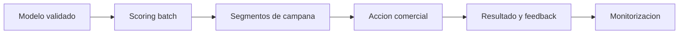

# Hito 4: Despliegue y monitorización

## Datos de la entrega

- Asignatura: **DESARROLLO Y DESPLIEGUE DE SOLUCIONES BIG DATA**
- Máster: **Máster Universitario en Big Data y Computación en la Nube**
- Curso académico: **2025-2026**
- Integrantes:
- **Alonso Marcos Muñoz** (`Alonso.Marcos@alu.uclm.es`)
- **Jose Barros Ribademar** (`Jose.Barros1@alu.uclm.es`)
- Fecha prevista del hito: **1 de mayo de 2026**

## 1. Objetivo del hito

El objetivo de este hito es poner en operación el modelo seleccionado en el Hito 3, definir monitorización técnica y de negocio, y cerrar un ciclo básico de mejora continua.

## 2. Estrategia de despliegue

El despliegue se plantea en modo batch para mantener control de riesgo y coste. La salida del modelo alimentará campañas segmentadas de retención con periodicidad definida.

La estrategia inicial prioriza:

- Estabilidad de ejecución.
- Trazabilidad de predicciones.
- Facilidad de rollback ante incidencias.

## 3. Integración operativa

La integración mínima contempla:

- Generación de scoring de riesgo de churn.
- Entrega de segmentos de clientes a sistema de campañas.
- Registro de respuesta de campaña para realimentar el modelo.

## 4. Monitorización

### 4.1 Monitorización técnica

- Éxito/fallo de ejecuciones.
- Latencia de pipeline y tiempos de actualización.
- Calidad de datos en entrada.

### 4.2 Monitorización del modelo

- Evolución de recall y precisión en producción.
- Detección de data drift y concept drift.
- Señales de degradación para decidir reentrenamiento.

### 4.3 Monitorización de negocio

- Clientes retenidos frente al escenario base.
- Descuentos evitados por mejor segmentación.
- Diferencia entre ROI estimado y ROI observado.

## 5. Riesgos y plan de respuesta

- Riesgo de caída del pipeline: reintento y rollback al último scoring válido.
- Riesgo de degradación del modelo: alertas por umbrales y plan de reentrenamiento.
- Riesgo de mala adopción operativa: documentación clara y validación con usuarios de negocio.

## 6. Resultado esperado del hito

Al finalizar el Hito 4, el proyecto debe quedar cerrado con un flujo funcional de extremo a extremo: datos, modelo, activación de campañas y seguimiento continuo del impacto.
