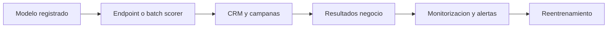

# Hito 4: Despliegue y monitorización

## Datos de la entrega

- Asignatura: **DESARROLLO Y DESPLIEGUE DE SOLUCIONES BIG DATA**
- Máster: **Máster Universitario en Big Data y Computación en la Nube**
- Curso académico: **2025-2026**
- Integrantes:
- **Alonso Marcos Muñoz** (`Alonso.Marcos@alu.uclm.es`)
- **JBJOSE Barros Ribademar** (`Jose.Barros1@alu.uclm.es`)
- Fecha de edición de plantilla: **febrero de 2026**

## 1. Objetivo

Poner en producción la solución de churn y definir monitorización técnica y de negocio.

Fecha objetivo oficial: **1 de mayo de 2026**.

## 2. Estructura recomendada

### 2.1 Estrategia de despliegue

- Entornos (dev, staging, prod).
- Estrategia de release (canary, blue/green o lotes).
- Plan de rollback.

### 2.2 Integración operativa

- Integración con CRM/campañas.
- Frecuencia de scoring.
- Gestión de incidencias.

### 2.3 Monitorización del modelo

- Métricas online/offline.
- Detección de data drift y concept drift.
- Alarmado y umbrales.

### 2.4 Monitorización de negocio

- Clientes retenidos.
- Incentivos evitados.
- ROI real vs ROI estimado.

### 2.5 Gobierno y cumplimiento

- Auditoría de decisiones.
- Controles de privacidad.
- Seguimiento de fairness en producción.

## 3. Diagrama Mermaid pendiente

## 4. Checklist de cierre

- [ ] Despliegue operativo funcional.
- [ ] Observabilidad técnica activa.
- [ ] KPIs de negocio medidos en producción.
- [ ] Plan de mejora continua definido.
